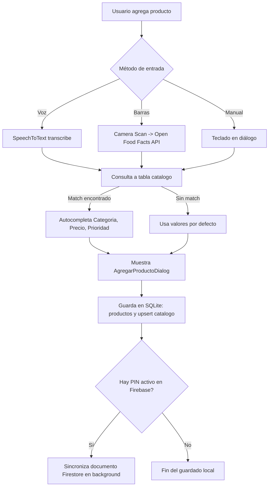

# 🛒 SmartCart: Guía de Arquitectura y Contexto para Agentes de IA

> **Documento de Contexto Maestro y Toma de Decisiones Técnicas**  
> **Versión del Proyecto:** `1.0.1+2` | **SDK Dart:** `^3.11.1` | **Framework:** `Flutter 3.x (Material Design 3)`  
> **Propósito:** Proporcionar a cualquier agente de IA o desarrollador el entendimiento exhaustivo del sistema, su arquitectura de datos, flujos de negocio, restricciones críticas y guía para la toma de decisiones futuras.

---

## 1. Visión General del Producto y Propuesta de Valor

**SmartCart** (`lista_supermercado`) es una aplicación móvil inteligente orientada a la planificación, ejecución y control presupuestario de compras físicas de supermercado y farmacia. 

A diferencia de una lista de tareas tradicional, SmartCart está construida sobre un modelo **offline-first adaptativo con capacidades multimodales y sincronización en tiempo real**:
- **Captura Multimodal:** Entrada de productos mediante **Voz (STT)**, teclado y **Escaneo de Código de Barras (cámara + Open Food Facts API)**.
- **Asistente Manos Libres en Tienda:** Motor **Text-to-Speech (TTS)** integrado para lectura auditiva de la lista de pendientes mientras el usuario empuja el carrito.
- **Memoria Predictiva (Catálogo Inteligente):** Al agregar productos, la app recuerda y autocompleta categoría, prioridad y precios históricos estimados mediante aprendizaje pasivo.
- **Control Presupuestario y Auditoría:** Barra de gasto en tiempo real, resumen de progreso y registro de compras con desglose exacto de productos adquiridos.
- **Sincronización Dual (Colaborativa y Fuera de Línea):** Sincronización en la nube vía **Firebase Firestore** con PINs de 6 caracteres legibles, más respaldo local absoluto en **SQLite** y exportación/importación offline en **Base64**.
- **Gestión Multi-Lista y Categorización Dinámica:** Soporte para listas (`supermercado`, `farmacia`), organización por pasillos y personalización de categorías con iconos y paletas temáticas.

---

## 2. Pila Tecnológica (Tech Stack)

| Capa / Subsistema | Tecnología / Paquete | Versión | Rol en el Proyecto |
|---|---|---|---|
| **Lenguaje & Core** | Dart / Flutter | `^3.11.1` | Base del proyecto multiplataforma |
| **Gestión de Estado** | `provider` | `^6.1.2` | `ListaProvider` centralizado (`ChangeNotifier`) |
| **Persistencia Local** | `sqflite`, `path`, `path_provider` | `^2.3.0` | Base de datos SQLite relacional (`supermercado.db`) |
| **Configuraciones & Caché** | `shared_preferences` | `^2.3.5` | Preferencias de usuario, perfil, avatar y configuración de SMS |
| **Cloud & Sincronización** | `firebase_core`, `cloud_firestore` | `^4.7.0` / `^6.3.0` | Sincronización colaborativa en vivo con PINs de sesión |
| **Reconocimiento de Voz** | `speech_to_text` | `^7.0.0` | Dictado por voz continuo en español con auto-reintento |
| **Síntesis de Voz (TTS)** | `flutter_tts` | `^3.8.5` | Lectura de pendientes en voz alta con motor en español |
| **Escáner de Barras** | `simple_barcode_scanner` | `^0.6.0` | Escaneo mediante cámara para códigos EAN/UPC |
| **Consumo de APIs REST** | `http` | `^1.6.0` | Consulta a Open Food Facts (`world.openfoodfacts.org`) |
| **Compartición & Enlaces** | `share_plus`, `url_launcher` | `^10.1.3` / `^6.3.1` | Compartir listas, abrir SMS y correo de soporte |
| **Multimedia / Perfil** | `image_picker` | `^1.2.2` | Selección de foto de perfil desde galería |
| **Diseño / Navegación** | `google_nav_bar`, Material 3 | `^5.0.7` | Barra de navegación flotante con animaciones y soporte Dark Mode |

---

## 3. Estructura de Directorios y Responsabilidades

```
lista_supermercado/
├── android/                    # Configuración nativa Android (Permisos de micro, cámara, SMS, almacenamiento)
├── ios/                        # Configuración nativa iOS (Info.plist para micro, cámara y TTS)
├── assets/                     # Recursos visuales (iconos, avatares por defecto)
├── lib/
│   ├── main.dart               # Punto de entrada. Inicialización de Firebase, MultiProvider (lazy: false), temas claro/oscuro y MainNavigation
│   ├── models/
│   │   ├── producto.dart       # Entidad Producto con generación de UUID v4 y serialización toMap/fromMap
│   │   ├── categoria_model.dart# Entidad CategoriaModel (nombre, colorValue, iconCode)
│   │   └── historial_compra.dart# Entidad HistorialCompra con snapshot JSON (`productosJson`)
│   ├── providers/
│   │   └── lista_provider.dart # Lógica de negocio central: SQLite CRUD, listener Firestore, checkout y exportaciones
│   ├── services/
│   │   ├── db_service.dart     # Capa SQLite (versión actual 7, migraciones, CRUD de tablas)
│   │   └── firebase_service.dart# Cliente Firestore para sincronización por PIN y generación de códigos únicos
│   ├── theme/
│   │   └── colors.dart         # Constantes de color (kVerde, kVerdeClaro, kVerdeMenta, kNaranja, etc.)
│   ├── views/
│   │   ├── agregar_voz_view.dart      # Pantalla 1: Dictado por voz, escáner de barras y entrada manual
│   │   ├── lista_compras_view.dart    # Pantalla 2: Carrito activo, TTS, barra de presupuesto, agrupación por pasillos
│   │   ├── categorias_view.dart       # Pantalla 3: Catálogo interactivo de categorías con expansión y CRUD
│   │   ├── historial_compras_view.dart# Vista secundaria: Facturas pasadas, modal desglose y reutilización de listas
│   │   └── perfil_view.dart           # Pantalla 4: Avatar/Emoji, estadísticas, gráfico de barras de gastos y ajustes SMS
│   └── widgets/
│       ├── agregar_producto_dialog.dart    # Modal de confirmación al capturar producto (autocompletado, precio, cantidad)
│       ├── editar_producto_dialog.dart     # Modal para modificar productos existentes
│       ├── producto_card.dart              # Tarjeta de producto con animación, checkbox hápico y swipe/dismissible
│       ├── barra_progreso_presupuesto.dart # Barra inferior con cálculo de gasto acumulado y porcentaje
│       └── dialogos_sincronizacion.dart    # Diálogos de Conectar/Compartir en vivo (PIN Firebase o Base64)
├── test/
│   └── producto_test.dart      # Pruebas unitarias de integridad de UUID v4 y serialización
├── ux_survey/                  # Estudio de mercado UX (Google Apps Script + JSON de encuesta)
├── pubspec.yaml                # Dependencias y configuración de assets
└── PROJECT_CONTEXT.md          # Este documento (Referencia de arquitectura)
```

---

## 4. Arquitectura de Datos y Persistencia

### 4.1. Base de Datos SQLite Local (`supermercado.db`)
El servicio `DBService` gestiona el esquema local utilizando control de versiones y migraciones incrementales `onUpgrade`:

* **Versión actual de BD:** `7`
* **Historial de migraciones:**
  * **v1:** Creación base de tabla `productos`.
  * **v2:** Adición de columna `precioEstimado` en `productos`.
  * **v3:** Creación de tablas `catalogo` e `historial_compras`.
  * **v4:** Adición de columna `productosJson` a `historial_compras` para guardar el snapshot serializado de la compra.
  * **v5:** Creación e inicialización de tabla `categorias` con 8 categorías base predeterminadas.
  * **v6:** Adición de columna `tipoLista` (`'supermercado'` / `'farmacia'`) a `productos`.
  * **v7:** Adición de columna `uuid` (TEXT NOT NULL UNIQUE) a `productos` y generación retroactiva de UUIDs para sincronización unívoca con la nube.

#### Tablas en SQLite:
1. **`productos`**: Carrito activo.
   ```sql
   CREATE TABLE productos (
     id INTEGER PRIMARY KEY AUTOINCREMENT,
     uuid TEXT NOT NULL UNIQUE,
     nombre TEXT NOT NULL,
     categoria TEXT NOT NULL,
     cantidad INTEGER NOT NULL,
     comprado INTEGER NOT NULL,
     prioridad TEXT NOT NULL,
     precioEstimado REAL NOT NULL DEFAULT 0.0,
     tipoLista TEXT NOT NULL DEFAULT 'supermercado'
   );
   ```
2. **`catalogo`**: Base de conocimiento local de productos conocidos.
   ```sql
   CREATE TABLE catalogo (
     id INTEGER PRIMARY KEY AUTOINCREMENT,
     nombre TEXT NOT NULL,
     categoria TEXT NOT NULL,
     prioridad TEXT NOT NULL,
     precioEstimado REAL NOT NULL DEFAULT 0.0
   );
   ```
3. **`historial_compras`**: Registros de compras finalizadas.
   ```sql
   CREATE TABLE historial_compras (
     id INTEGER PRIMARY KEY AUTOINCREMENT,
     fecha TEXT NOT NULL,
     total REAL NOT NULL,
     cantidadProductos INTEGER NOT NULL,
     productosJson TEXT
   );
   ```
4. **`categorias`**: Catálogo de categorías configurables.
   ```sql
   CREATE TABLE categorias (
     id INTEGER PRIMARY KEY AUTOINCREMENT,
     nombre TEXT NOT NULL,
     colorValue INTEGER NOT NULL,
     iconCode INTEGER NOT NULL
   );
   ```

### 4.2. Esquema en Cloud Firestore
- **Colección:** `listas`
- **Documento:** `{PIN}` (Código de 6 caracteres alfanuméricos en mayúsculas, ej. `7B4M9K`).
- **Campos del Documento:**
  ```json
  {
    "productos": [
      {
        "uuid": "8c59f032-6a4a-4b96-932b-42fa60541991",
        "nombre": "Leche Descremada",
        "categoria": "Lácteos",
        "cantidad": 2,
        "comprado": 0,
        "prioridad": "Alta",
        "precioEstimado": 45.0,
        "tipoLista": "supermercado"
      }
    ],
    "ultimaActualizacion": "Timestamp"
  }
  ```

---

## 5. Flujos de Negocio Críticos y Lógica de Sincronización



### 5.1. Ciclo de Vida del Checkout (`terminarCompra`)
1. **Filtro selectivo:** Solo se procesan los productos con `comprado == true`. Los pendientes permanecen intactos en la lista activa para compras futuras.
2. **Snapshot Serializado:** Se genera un `HistorialCompra` que encapsula el cálculo de `total`, conteo de ítems y la lista de comprados serializada en `productosJson`.
3. **Entrenamiento del Catálogo:** Se invoca `upsertCatalogo` para cada producto comprado, actualizando el último precio y categoría conocidos.
4. **Limpieza y Notificación:** Se eliminan de `productos` los comprados y se dispara `notifyListeners()` y `_syncNube()` si existe conexión activa.

### 5.2. Motor de Sincronización en la Nube (Firebase Stream)
- Cuando el usuario se conecta a un PIN (`conectarFirebase`), se suscribe un `StreamSubscription` a Firestore.
- Para evitar bucles infinitos (`echo loops`), `ListaProvider` utiliza un flag `_isSyncing`.
- **Resolución de conflictos por UUID:** Al recibir datos de Firestore, el algoritmo compara por `uuid`:
  1. Si un UUID local no está en el payload remoto, se elimina de SQLite.
  2. Si un UUID existe en ambos pero cambiaron atributos (`nombre`, `comprado`, etc.), se actualiza en SQLite.
  3. Si un UUID es nuevo, se inserta en SQLite (con `id = null` para que SQLite asigne clave autoincremental propia).

### 5.3. Compartir Offline / Fallback en Base64
- **Exportación:** Serializa los productos pendientes a JSON, los codifica en UTF-8 y genera una cadena Base64 (`exportarListaBase64`).
- **Importación Inteligente:** Detecta patrones Base64 en cualquier texto pegado (incluso con texto adicional de WhatsApp), decodifica, recrea UUIDs nuevos para evitar colisiones y realiza suma acumulativa de cantidad si el producto ya existía.

---

## 6. Integraciones de Hardware y APIs del Sistema

1. **Reconocimiento de Voz (`speech_to_text`):**
   - Configurado con reinicio automático de escucha ante silencios intermitentes (`_restartListening`).
   - Prioriza locales en español (`es-ES`, `es-MX`, `es-US`, o `es`).
2. **Lectura Auditiva (`flutter_tts`):**
   - Configuración de velocidad (`0.5`), tono (`1.0`) y volumen (`1.0`).
   - Control de estados: Reproduciendo, Pausado, Detenido.
3. **Escáner de Códigos de Barras (`simple_barcode_scanner` + `http`):**
   - Abre escáner nativo; tras capturar código, consulta `https://world.openfoodfacts.org/api/v0/product/{barcode}.json` con timeout de 8 segundos.
   - Extrae `product_name_es` o `product_name` y lo envía automáticamente al diálogo de guardado.
4. **SMS Reminders (`url_launcher`):**
   - Construye esquema `sms:{telefono}?body=...` con lista formateada de pendientes para evitar requerir permisos invasivos de envío en segundo plano.
5. **Cámara / Galería (`image_picker`):**
   - Copia fotos seleccionadas al almacenamiento interno persistente (`getApplicationDocumentsDirectory()`) y guarda la ruta en `SharedPreferences`.

---

## 7. Reglas de Oro e Invariantes para Agentes (Directrices de No Ruptura)

> [!CAUTION]
> **REGLAS CRÍTICAS QUE CUALQUIER AGENTE DEBE RESPETAR AL MODIFICAR ESTE PROYECTO:**

1. **Invariante de Identidad (`UUID`):**
   - Nunca confíes exclusivamente en el `id` entero de SQLite para la sincronización con Firebase o la importación de listas. El `id` es local de cada dispositivo. La identidad global es siempre `uuid` (UUID v4 RFC 4122).
   - Al importar o duplicar productos de compras anteriores, SIEMPRE asigna `p.id = null` y genera un nuevo `uuid` mediante `Producto.generarUuid()`.
2. **Migraciones de Base de Datos (`DBService`):**
   - **NUNCA** elimines ni alteres las sentencias de migración previas (`oldVersion < 2`, ..., `< 7`).
   - Si requieres agregar columnas o tablas, incrementa la versión de la base de datos (e.g., a `8`) y añade un nuevo bloque `if (oldVersion < 8)` en `_upgradeDB`. Envuelve las sentencias `ALTER TABLE` en bloques `try/catch` para evitar fallos si la columna ya existía.
3. **Inicialización Eager del Provider (`main.dart`):**
   - Mantén `ChangeNotifierProvider(create: (_) => ListaProvider()..cargarListas(), lazy: false)`. Si se vuelve perezoso (`lazy: true`), las categorías no estarán cargadas al abrir el primer diálogo y se mostrará erróneamente solo "Otros".
4. **Modo Oscuro / Adaptación de Tema:**
   - No hardcodees `Colors.white` o `Colors.black` en fondos ni tarjetas. Usa siempre `Theme.of(context).cardColor`, `Theme.of(context).scaffoldBackgroundColor`, o evalúa `final isDark = Theme.of(context).brightness == Brightness.dark;` para contrastes.
5. **Respaldo Local Primero (Offline-First):**
   - La aplicación debe funcionar al 100% de sus capacidades core (guardar, editar, comprar, historial, catálogo, TTS) incluso sin conexión a internet ni Firebase configurado.

---

## 8. Estado Actual y Oportunidades de Mejora (Roadmap)

A partir del análisis del código, se identifican las siguientes tareas técnicas y de producto listas para abordarse:

| Tarea / Oportunidad | Archivos Involucrados | Descripción / Estado Actual |
|---|---|---|
| **Selector visual de Lista (Supermercado vs Farmacia)** | `lib/views/lista_compras_view.dart`, `lib/providers/lista_provider.dart` | La columna `tipoLista` ya existe en el modelo y en la BD SQLite (v6), pero la vista actual de `ListaComprasView` no expone un switch/segmento en la AppBar para alternar entre `'supermercado'` y `'farmacia'`. |
| **Reglas de Seguridad Firestore** | `lib/services/firebase_service.dart`, `firestore.rules` | La base de datos Firestore se inicializó en modo de prueba. Se recomienda configurar reglas de expiración de documentos o TTL para limpiar listas inactivas tras 30 días. |
| **Manejo de Errores de Conexión en Escáner** | `lib/views/agregar_voz_view.dart` | Reforzar el feedback si la API de Open Food Facts no encuentra el producto o el usuario no tiene conexión al escanear. |
| **Ampliación de Pruebas Automatizadas** | `test/` | Actualmente solo existe `producto_test.dart`. Se pueden añadir pruebas de widgets (`widget_test.dart`) y pruebas unitarias para `ListaProvider` (cálculo de presupuesto, exportación Base64, checkout). |

---

*Archivo generado automáticamente para interoperabilidad de agentes de IA y gobernanza técnica del proyecto SmartCart.*
