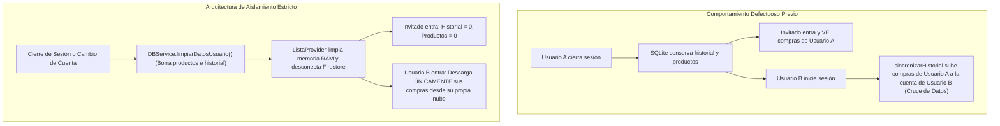

# Plan de Solución: Limpieza de Pantalla al Finalizar Compra y Aislamiento Estricto de Datos entre Usuarios / Modo Invitado

## 1. Diagnóstico del Comportamiento Actual

### Problema 1: La pantalla no se limpia ni se desvincula al terminar la compra (ambos teléfonos)
- **Causa en Dispositivo A (Quien finaliza):** En `ListaProvider.terminarCompra()`, se eliminan los productos comprados de SQLite, pero:
  1. `_pinActual` no se reinicia a `null`.
  2. No se llama a `desconectarFirebase()`.
  3. No se vacían los productos en memoria ni en pantalla.
- **Causa en Dispositivo B (Participante que escucha por stream):** En `ListaProvider._escucharCambiosFirebase()`:
  1. Recibe el evento de compra finalizada y guarda el ticket en `historial_compras`.
  2. **Nunca borra los productos locales** (`deleteAllProductos()`), **nunca limpia la lista en memoria** (`_productos.clear()`) y **nunca se desconecta** (`desconectarFirebase()`).
- **Causa en Firestore (`listas/{PIN}`):** El documento principal conserva el listado anterior de productos en vez de vaciar `'productos': []` y marcar `'finalizada': true`.
- **Por qué se solucionaba al reiniciar la app:** Al cerrar la app, las variables en memoria (`_pinActual` y la suscripción de stream) se destruyen; al abrirla de nuevo, arranca en modo local y lee SQLite donde los productos ya habían sido eliminados.

---

### Problema 2: Fuga y cruce de datos entre usuarios registrados y modo invitado
- **Causa en Cierre de Sesión (`PerfilView._cerrarSesion`):** Solo llama a `AuthService.instance.signOut()`. **La base de datos local SQLite (`historial_compras`, `productos`) NO se borra**.
- **Causa en Entrada como Invitado:** El invitado entra y la app lee la tabla local `historial_compras`, exponiendo todas las compras previas del usuario registrado.
- **Causa en Inicio de Sesión de Usuario B:** Cuando el Usuario B inicia sesión en un dispositivo donde estuvo el Usuario A:
  1. En `ListaProvider.sincronizarHistorialConFirebase()`, la app lee todas las compras locales (que pertenecen al Usuario A).
  2. Al ejecutar `guardarHistorialUsuario(userB.uid, local)`, **¡las compras del Usuario A se suben y se mezclan permanentemente en la nube del Usuario B!**
  3. Igualmente, los productos pendientes que dejó el Usuario A o el Invitado se le muestran al Usuario B.



---

## 2. Cambios Propuestos y Arquitectura

### A. Capa de Base de Datos Local (`DBService`)
#### [MODIFY] [`lib/services/db_service.dart`](file:///c:/Users/Joan%20Marquez/Documents/GitHub/lista_supermercado/lib/services/db_service.dart)
- Agregar método `Future<int> deleteAllHistorial()`:
  - Ejecuta `db.delete('historial_compras')`.
- Agregar método `Future<int> deleteAllCatalogo()`:
  - Ejecuta `db.delete('catalogo')`.
- Agregar método centralizado `Future<void> limpiarDatosUsuario({bool limpiarCatalogo = false})`:
  - Limpia completamente `productos` y `historial_compras` (y opcionalmente `catalogo`).
  - Mantiene intacta la tabla `categorias` (categorías base del supermercado).

---

### B. Capa de Estado y Sincronización (`ListaProvider`)
#### [MODIFY] [`lib/providers/lista_provider.dart`](file:///c:/Users/Joan%20Marquez/Documents/GitHub/lista_supermercado/lib/providers/lista_provider.dart)

1. **Limpieza y Desvinculación en `terminarCompra()` (Dispositivo que finaliza):**
   - Vaciar completamente la base de datos local y memoria:
     ```dart
     await DBService.instance.deleteAllProductos();
     _productos.clear();
     ```
   - Si la lista era compartida (`_pinActual != null`):
     - Registrar la finalización en Firestore.
     - Desvincular de inmediato: `desconectarFirebase()`.
   - Llamar `notifyListeners()` para actualizar la UI en blanco y en modo local instantáneamente.

2. **Detección y Reacción en `_escucharCambiosFirebase()` (Dispositivos remotos conectados):**
   - Al detectar compra finalizada (`ultimaCompra != null` o `data['finalizada'] == true`):
     ```dart
     // 1. Guardar la compra finalizada en historial local SQLite (y en su Firestore si está autenticado)
     await DBService.instance.upsertHistorial(nuevaCompra);
     ...
     // 2. Limpiar productos en memoria y SQLite
     await DBService.instance.deleteAllProductos();
     _productos.clear();
     _actividadReciente.clear();
     
     // 3. Notificar al usuario con banner
     compraCompartidaFinalizadaNotifier.value = '🛒 ¡$nombreFinalizador ha finalizado la compra!';
     
     // 4. Desvincularse de la lista en tiempo real
     desconectarFirebase();
     notifyListeners();
     return;
     ```

3. **Prevención de reconexión a listas finalizadas en `conectarFirebase(pin)`:**
   - Validar si la lista tiene `finalizada: true`. Si es así, lanzar:
     `Exception('Esta lista ya ha sido finalizada y cerrada.')`.

4. **Aislamiento de Sesión Multi-Usuario y Modo Invitado:**
   - Implementar método `limpiarDatosLocalesPorCierreDeSesion()`:
     - Cancela suscripciones de Firebase y reinicia `_pinActual = null`.
     - Borra en memoria `_productos` y `_actividadReciente`.
     - Ejecuta `DBService.instance.limpiarDatosUsuario()`.
     - Notifica cambios a los listeners.
   - Implementar método `verificarYLimpiarSesionSiCambioUsuario()`:
     - Comprueba el UID de la sesión previa en `SharedPreferences` (`current_session_uid`).
     - Determina la sesión actual: `currentUser?.uid ?? (isGuest ? 'guest' : null)`.
     - Si la sesión anterior no coincide con la actual (ej: cambió de Usuario A a Invitado, o de Usuario A a Usuario B):
       - Ejecuta `limpiarDatosLocalesPorCierreDeSesion()`.
     - Guarda el UID actual como `current_session_uid`.
   - En `cargarListas()`:
     - Ejecutar `await verificarYLimpiarSesionSiCambioUsuario();` **antes** de leer SQLite o sincronizar con Firestore.
     - De esta forma, si entra un Invitado, encontrará la base de datos limpia desde cero.
     - Si entra el Usuario B, encontrará la base de datos limpia y `sincronizarHistorialConFirebase()` descargará exclusivamente sus propias compras de la nube, sin cruzar las del Usuario A.

---

### C. Capa de Servicios en la Nube (`FirebaseService`)
#### [MODIFY] [`lib/services/firebase_service.dart`](file:///c:/Users/Joan%20Marquez/Documents/GitHub/lista_supermercado/lib/services/firebase_service.dart)
- En `registrarCompraFinalizadaCompartida`:
  - Enviar `'productos': []` (vaciado en la nube).
  - Enviar `'finalizada': true` (estado cerrado).
  - Enviar `'ultimaCompraFinalizada': ...`

---

### D. Capa de Interfaz de Usuario y Vistas
#### [MODIFY] [`lib/views/perfil_view.dart`](file:///c:/Users/Joan%20Marquez/Documents/GitHub/lista_supermercado/lib/views/perfil_view.dart)
- En `_cerrarSesion()`:
  - Invocar `await context.read<ListaProvider>().limpiarDatosLocalesPorCierreDeSesion();`.
  - Limpiar la variable de estado local `_historial = [];`.
  - Remover `smartcart_guest_mode` y `current_session_uid`.
  - Ejecutar `AuthService.instance.signOut()`.
  - Redirigir a `/` mediante `Navigator.of(context).pushNamedAndRemoveUntil('/', (route) => false)`.

#### [MODIFY] [`lib/widgets/auth_gate.dart`](file:///c:/Users/Joan%20Marquez/Documents/GitHub/lista_supermercado/lib/widgets/auth_gate.dart)
- En `_setGuestMode(true)`:
  - Al ingresar como invitado, verificar si la sesión previa era de un usuario registrado.
  - Llamar a `limpiarDatosLocalesPorCierreDeSesion()` para garantizar que el invitado comience completamente desde cero con 0 compras en historial y 0 productos.

---

## 3. Plan de Verificación y Pruebas

### Pruebas Unitarias y de Integración (`test/`)
1. **Pruebas de Finalización y Desvinculación de Lista (`test/finalizar_lista_cleanup_test.dart`):**
   - Verificar que al invocar `terminarCompra()`:
     - `_productos` quede vacío.
     - `pinActual` quede en `null`.
     - SQLite quede sin productos.
   - Simular recepción remota de `ultimaCompraFinalizada` / `finalizada: true`:
     - El participante debe guardar la compra en historial.
     - El participante debe vaciar sus productos locales.
     - El participante debe desvincular `pinActual` (`expect(provider.pinActual, isNull)`).
2. **Pruebas de Aislamiento de Usuarios y Modo Invitado (`test/user_data_isolation_test.dart`):**
   - Simular cierre de sesión y verificar que `deleteAllHistorial()` y `deleteAllProductos()` limpien la base de datos.
   - Simular cambio de sesión `user_A` -> `guest` y comprobar que el invitado inicia con lista e historial vacíos.
   - Simular cambio de sesión `user_A` -> `user_B` y comprobar que no se transfieren compras locales de `user_A` hacia la sincronización de `user_B`.
3. Ejecutar la suite completa:
   ```bash
   flutter test
   ```

### Verificación Manual
1. **Flujo de Finalización Compartida:**
   - Conectar Dispositivo A y B con el mismo PIN.
   - En Dispositivo A, pulsar "Terminar compra".
   - Comprobar que en Dispositivo A la lista queda vacía y ya no muestra el PIN.
   - Comprobar que en Dispositivo B, sin reiniciar la app, aparece el banner *"¡Familiar ha finalizado la compra!"*, su pantalla de lista queda vacía y se desvincula del PIN.
   - En ambos dispositivos, verificar que la compra está en su Historial.
2. **Flujo de Aislamiento de Usuario e Invitado:**
   - Iniciar sesión con un usuario con compras en su historial.
   - Ir a "Mi Perfil" y pulsar "Cerrar sesión".
   - Pulsar "Continuar como invitado".
   - Ir a "Historial de compras": **Debe estar completamente vacío ("Aún no tienes compras")**.
   - Ir a "Mi Lista": **Debe estar completamente vacía**.
   - Cerrar sesión de invitado e iniciar sesión con otro usuario nuevo: **Su historial no debe tener ninguna compra del usuario anterior**.
