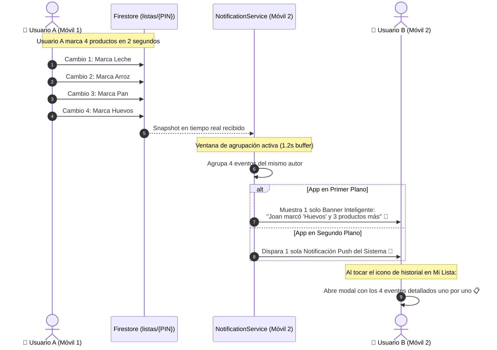

# Plan de Implementación Actualizado: Sistema de Notificaciones, Control Anti-Spam e Historial de Actividad en Listas Compartidas

Este documento describe la arquitectura técnica y el plan de ejecución para dotar a **SmartCart** de un sistema bidireccional de notificaciones no intrusivo con control anti-spam, modernización de la interfaz en "Mi Lista" y visualización del historial cronológico de cambios de la lista compartida.

---

## 1. Novedades y Mejoras Solicitadas

1. **Control Anti-Spam / Rate-Limiting para Modificaciones Rápidas:**
   - **Mecanismo de Ventana de Agrupación (Debounce & Batching de 1.2 segundos):** Si un miembro tacha o agrega varios productos rápidamente (ej. marca 4 productos en 2 segundos):
     - En lugar de disparar 4 banners consecutivos que saturen la pantalla, el despachador agrupa la ráfaga en una sola notificación inteligente:
       - *Ejemplo individual:* `Joan marcó "Arroz" como comprado`
       - *Ejemplo agrupado:* `Joan marcó "Huevos" y 3 productos más`
   - **Tiempo de Enfriamiento Mínimo (Cooldown de 2.5 a 3 segundos):** Espaciado mínimo garantizado entre banners para evitar parpadeos visuales en la interfaz.
   - **Preservación Total en Historial:** La agrupación solo aplica a las notificaciones en pantalla; en el registro de actividad de la lista se guardan todos los cambios individuales con detalle completo.
   - **Prioridad Inmediata para Finalizaciones:** Eventos críticos como `compraFinalizada` se disparan de forma instantánea sin demora de lote.

2. **Modernización de la Barra de Herramientas en "Mi Lista":**
   - **Simplificación del botón "Escuchar":** Reemplazar el contenedor con texto `Escuchar` / `Pausar` / `Reanudar` por un estilizado botón de solo icono (`Icons.volume_up_rounded` / `Icons.pause_rounded`) con tooltip descriptivo. Esto limpia el AppBar y le da un aspecto mucho más moderno y ligero.
   - **Nuevo Botón de Historial de Cambios:** Justo al lado del icono de audio, añadir un `IconButton` (`Icons.history_rounded` / `Icons.timeline_rounded`) con tooltip *"Historial de cambios"*.

3. **Modal / Panel de Registro de Actividad (`HistorialCambiosBottomSheet`):**
   - Al tocar el nuevo botón de historial:
     - **Si la lista está compartida:** Despliega una hoja inferior (Bottom Sheet) estilizada con la cronología completa de cambios recientes realizados por todos los miembros (quién agregó, tachó, editó o eliminó qué producto, con fecha/hora relativa ej. *"Hace 3 min"*).
     - **Si la lista es local (no compartida):** Muestra un diálogo informativo cordial invitando a compartir la lista o ingresar un PIN para disfrutar de colaboración en tiempo real con historial.

4. **Canales In-App y Push Locales:**
   - **In-App (Primer plano):** Banner superior flotante tipo HUD con auto-cierre en 3.5 segundos y deslizamiento para descartar.
   - **Push Local (Segundo plano / Minimizada):** Notificación nativa en la barra de estado del sistema (`flutter_local_notifications`).
   - **Respeto a Preferencias:** Vinculado al toggle de Notificaciones del Perfil (`user_notifs_$uid` / `guest_notifs`).

---

## 2. Flujo Arquitectónico del Control Anti-Spam



---

## 3. Estructura de Datos en Firestore y Modelos

### A. Documento `listas/{PIN}`
```json
{
  "productos": [...],
  "categorias": [...],
  "ultimaActualizacion": "TIMESTAMP",
  "ultimoCambio": {
    "id": "uuid-v4",
    "autorUid": "uid_o_guest_id",
    "autorNombre": "Carlos",
    "tipo": "productoComprado",
    "productoNombre": "Arroz",
    "detalle": "x2",
    "timestamp": 1727878900
  },
  "actividadReciente": [
    {
      "id": "uuid-1",
      "autorUid": "uid_1",
      "autorNombre": "Joan",
      "tipo": "productoAgregado",
      "productoNombre": "Leche",
      "detalle": "x1",
      "timestamp": 1727878850
    },
    {
      "id": "uuid-2",
      "autorUid": "uid_2",
      "autorNombre": "Carlos",
      "tipo": "productoComprado",
      "productoNombre": "Arroz",
      "detalle": "x2",
      "timestamp": 1727878900
    }
  ]
}
```
*Se mantiene un arreglo acotado (últimos 30 eventos) para acceso instantáneo sin costo de consultas adicionales.*

### B. Modelo `NotificacionEvento` (`lib/models/notificacion_evento.dart`)
- Campos:
  - `String id`
  - `String autorUid`
  - `String autorNombre`
  - `TipoNotificacionLista tipo` (`productoAgregado`, `productoComprado`, `productoDesmarcado`, `productoEditado`, `productoEliminado`, `compraFinalizada`, `listaReiniciada`, `listaVaciada`)
  - `String? productoNombre`
  - `String? detalle`
  - `DateTime timestamp`
- Métodos auxiliares:
  - `tituloFormateado`
  - `descripcionFormateada`
  - `icono` y `color`
  - `tiempoRelativo()` (ej. *"Hace un momento"*, *"Hace 5 min"*, *"10:45 AM"*)

---

## 4. Componentes a Desarrollar y Modificar

### 1. Dependencias (`pubspec.yaml` y `android/app/src/main/AndroidManifest.xml`)
- Agregar `flutter_local_notifications: ^22.3.1`.
- Declarar `<uses-permission android:name="android.permission.POST_NOTIFICATIONS"/>` en `AndroidManifest.xml`.

### 2. `NotificationService` con Anti-Spam (`lib/services/notification_service.dart`)
- Singleton centralizado:
  - **Buffer de Lotes (`_bufferEventos`):** Temporizador de 1.2 segundos para agrupar ráfagas de cambios de un mismo autor.
  - **Tiempo de Enfriamiento (`_ultimoBannerTimestamp`):** Mínimo 2.5s entre despliegues de banners consecutivos.
  - **Generador de Mensaje Agrupado:**
    - 1 cambio: `"$autorNombre marcó \"$producto\" como comprado"`
    - Varios cambios: `"$autorNombre realizó $n modificaciones en la lista"`
  - **Filtro de Auto-Acciones:** Si `evento.autorUid == miActorUid`, se ignora totalmente.
  - **Verificación de Preferencias:** Consulta de `user_notifs_$uid` o `guest_notifs` antes de emitir cualquier alerta.
  - **Manejo de Ciclo de Vida:** Si está en primer plano muestra Banner In-App; si está en segundo plano emite notificación local al sistema operativo.

### 3. Widget de Notificación In-App (`lib/widgets/in_app_notification_banner.dart`)
- Tarjeta flotante superior con animación suave de descenso (`SlideTransition`), feedback háptico (`HapticFeedback.lightImpact()`), icono coloreado de la acción y soporte de arrastre hacia arriba para cerrar.

### 4. Modal de Registro de Actividad (`lib/widgets/historial_cambios_modal.dart`)
- Hoja inferior deslizante (`DraggableScrollableSheet` o `showModalBottomSheet`):
  - Cabecera con PIN de la lista compartida y botón de cierre.
  - Lista cronológica inversa con tarjetas elegantes:
    - Avatar/Icono temático según la acción.
    - Nombre del miembro en negrita.
    - Descripción clara del cambio y cantidad.
    - Hora del cambio relativa (*"Hace 2 min"*).
  - Estado vacío amigable cuando la lista no tenga cambios recientes registrados aún.

### 5. Modificaciones en `ListaComprasView` (`lib/views/lista_compras_view.dart`)
- En el `AppBar.actions`:
  - **Botón "Escuchar":** Reemplazar el contenedor con texto por un `IconButton` redondeado y estilizado con icono `Icons.volume_up_rounded` / `Icons.pause_rounded`.
  - **Nuevo Botón de Historial:** Agregar `IconButton(icon: Icon(Icons.history_rounded), ...)` justo a la derecha del botón de audio.
  - Al presionarlo:
    - Si `provider.pinActual != null`, abrir `HistorialCambiosModal.mostrar(...)`.
    - Si no, mostrar advertencia amigable indicando que se requiere una lista compartida.

### 6. Actualización en `FirebaseService` y `ListaProvider`
- Inyección de `ultimoCambio` y actualización de `actividadReciente` (últimos 30 eventos con inserción FIFO) en `syncListaCompleta` y `registrarCompraFinalizadaCompartida`.
- En `ListaProvider`, emitir los eventos con el nombre y UID del actor en cada acción (`agregarProducto`, `toggleComprado`, etc.).
- En `_escucharCambiosFirebase`, alimentar `actividadReciente` al estado de la lista y canalizar los eventos entrantes hacia `NotificationService`.

---

## 5. Pruebas Automatizadas

Creación de suite de tests en `test/notification_service_test.dart`:
1. **Pruebas de Formato y Agrupación:** Verificar que ráfagas de 3 o más eventos se consoliden en un solo mensaje comprensible.
2. **Pruebas de Anti-Spam y Cooldown:** Validar que múltiples llamadas sucesivas respeten el enfriamiento y no saturen la cola de notificaciones.
3. **Pruebas de Filtrado Propio:** Confirmar que acciones generadas por el propio usuario son descartadas sin generar alertas.
4. **Pruebas de Interfaz:** Validar que el botón "Escuchar" solo renderice el icono, que el nuevo botón de historial exista en el árbol de widgets y que el modal de actividad despliegue los eventos correctamente.
5. **Pruebas de Regresión:** Asegurar que los 24 tests unitarios existentes sigan pasando al 100% y `flutter analyze` finalice con 0 advertencias.

---

## 6. Estado y Aprobación

El plan incorpora todas las observaciones solicitadas:
- Control de spam con debounce, batching inteligente y cooldown.
- Botón "Escuchar" limpio de solo icono.
- Botón y modal de registro de actividad para la lista compartida.
- Notificaciones In-App y Push locales coordinadas con las preferencias del usuario.
