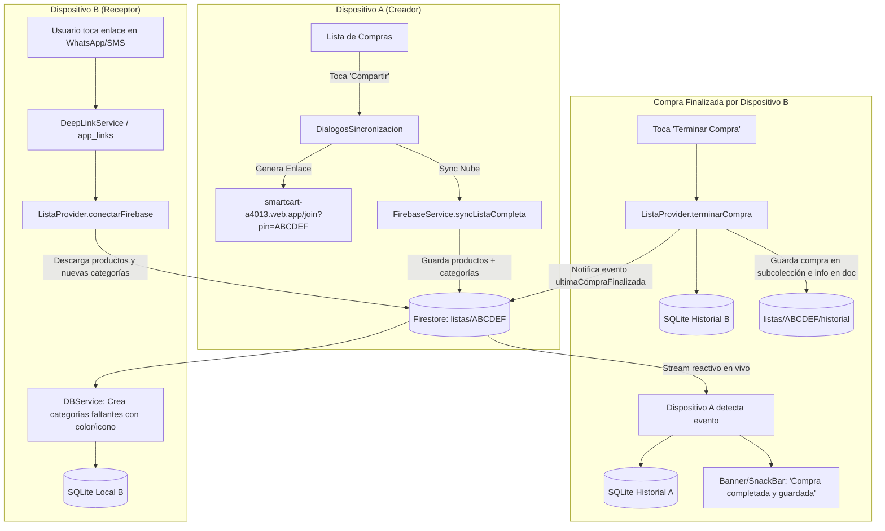

# 🚀 Plan de Implementación: Sincronización en la Nube, Historial Compartido, Categorías y Deep Linking

**Proyecto:** SmartCart (Lista de Supermercado)  
**Fecha:** 2 de Octubre de 2026  
**Rama:** `improvements-login-with-mail-and-google`  
**Objetivo:** Enlazar la información de compras y listas a los usuarios para garantizar cero pérdida de datos, sincronización multi-dispositivo en tiempo real y compartir listas mediante enlaces interactivos directos.

---

## 1. Descripción del Objetivo

El objetivo de esta fase es evolucionar SmartCart de una sincronización básica en tiempo real a un ecosistema colaborativo y persistente:
1. **Persistencia e Historial por Usuario:** Sincronizar el historial de compras de SQLite local con Cloud Firestore para que los usuarios no pierdan sus compras pasadas al cambiar de dispositivo.
2. **Finalización Colaborativa Multi-Dispositivo:** Si una lista se comparte entre familiares y cualquiera finaliza la compra desde su dispositivo, la compra se añade automáticamente al historial de compras de todos los miembros de esa lista.
3. **Sincronización de Categorías Personalizadas:** Cuando se comparta una lista que incluya categorías creadas por el usuario emisor (con su nombre, color e ícono), estas se importarán y crearán automáticamente en el SQLite local del receptor si no las tiene.
4. **Compartir mediante Enlace Directo (Deep Linking / App Links):** En lugar de enviar un texto plano con el PIN, se generará y compartirá un enlace directo (`https://smartcart-a4013.web.app/join?pin=XXXXXX` y `smartcart://join?pin=XXXXXX`) que al tocarlo abra la app y conecte la lista inmediatamente.

---

## 2. Decisiones de Diseño y Revisión Requerida

> [!IMPORTANT]
> **Migración de SQLite local a versión 8:**
> Para enlazar sin colisiones los historiales locales con Firestore, agregaremos una columna `uuid TEXT UNIQUE` y `pinLista TEXT` a la tabla `historial_compras`. Los registros existentes recibirán un UUID generado automáticamente para que nunca se dupliquen al sincronizar.

> [!TIP]
> **Tolerancia Offline / Modo Invitado Preservado:**
> Los usuarios en *Modo Invitado* continuarán operando 100% sobre SQLite local. Si un invitado abre un enlace compartido, podrá unirse a la lista en vivo; y si decide registrarse posteriormente, su historial local se sincronizará automáticamente con su nueva cuenta en Firestore.

---

## 3. Preguntas Abiertas para el Usuario

1. **Confirmación al abrir enlace con lista local activa:**  
   Si el usuario ya tiene productos en su lista local y hace clic en un enlace de invitación:  
   *¿Prefieres que la app muestre un diálogo de confirmación ("Tienes X productos en tu lista. ¿Deseas unirte a la lista de tu familiar?") o que se conecte directamente?*  
   *(Recomendación: Mostrar diálogo de confirmación para evitar sobrescrituras no deseadas).*
2. **Dominio de Enlace:**  
   Utilizaremos el subdominio gratuito y oficial asignado al proyecto Firebase: `https://smartcart-a4013.web.app/join?pin=XXXXXX` junto al esquema nativo `smartcart://join?pin=XXXXXX`. ¿Te parece adecuada esta nomenclatura?

---

## 4. Arquitectura y Flujo de Datos



---

## 5. Cambios Propuestos por Componente

---

### Componente 1: Dependencias y Enlaces Profundos (`Deep Links`)
* **Objetivo:** Instalar el paquete estándar `app_links` y registrar los `intent-filters` en Android y esquemas en iOS.

#### [MODIFY] `pubspec.yaml`
- Añadir dependencia: `app_links: ^7.2.1`

#### [MODIFY] `android/app/src/main/AndroidManifest.xml`
- Agregar `intent-filter` dentro de `MainActivity` para:
  - Custom scheme: `smartcart://join`
  - Universal / App Link: `https://smartcart-a4013.web.app/join`

```xml
<!-- Deep Link: Custom Scheme smartcart://join?pin=... -->
<intent-filter>
    <action android:name="android.intent.action.VIEW" />
    <category android:name="android.intent.category.DEFAULT" />
    <category android:name="android.intent.category.BROWSABLE" />
    <data android:scheme="smartcart" android:host="join" />
</intent-filter>

<!-- App Link: HTTPS smartcart-a4013.web.app/join -->
<intent-filter android:autoVerify="true">
    <action android:name="android.intent.action.VIEW" />
    <category android:name="android.intent.category.DEFAULT" />
    <category android:name="android.intent.category.BROWSABLE" />
    <data android:scheme="https" android:host="smartcart-a4013.web.app" android:pathPrefix="/join" />
    <data android:scheme="http" android:host="smartcart-a4013.web.app" android:pathPrefix="/join" />
</intent-filter>
```

#### [NEW] `lib/services/deep_link_service.dart`
- Servicio singleton que escucha enlaces entrantes tanto al arrancar la app en frío (`getInitialLink`) como en tiempo de ejecución (`uriLinkStream`).
- Extrae el parámetro `pin` y notifica a `ListaProvider`.

---

### Componente 2: Modelos y Base de Datos Local (`SQLite`)
* **Objetivo:** Soportar UUIDs únicos en el historial y columnas para la sincronización con la nube.

#### [MODIFY] `lib/models/historial_compra.dart`
- Agregar campos:
  - `String uuid;`
  - `String? pinLista;`
  - `String? finalizadoPorNombre;`
- Adaptar `toMap()` y `fromMap()` manteniendo retrocompatibilidad.

#### [MODIFY] `lib/services/db_service.dart`
- Incrementar versión de base de datos a `8`.
- En `_upgradeDB`: agregar columnas `uuid` y `pinLista` a `historial_compras` e inicializar UUIDs para registros antiguos.
- Nuevo método: `Future<bool> historialExists(String uuid)` para evitar duplicación.
- Nuevo método: `Future<void> upsertHistorial(HistorialCompra hc)` para inserción idempotente durante la sincronización bidireccional.

---

### Componente 3: Sincronización con Firestore (`FirebaseService`)
* **Objetivo:** Persistencia en Firestore de historiales de usuario, gestión de miembros de listas compartidas y registro de compras finalizadas.

#### [MODIFY] `lib/services/firebase_service.dart`
- **Sincronización de Historial Personal:**
  - `Future<void> syncHistorialUsuario(String userId, List<HistorialCompra> locales)`:
    - Sube registros locales faltantes a `usuarios/{userId}/historial_compras/{uuid}`.
    - Devuelve los registros remotos para insertarlos en SQLite local.
- **Sincronización de Categorías:**
  - `syncListaCompleta(String pin, List<Producto> productos, List<CategoriaModel> categorias)`:
    - Ahora almacena en el documento `listas/{pin}` tanto `productos` como `categorias` (con `nombre`, `colorValue`, `iconCode`).
- **Gestión de Miembros y Finalización Compartida:**
  - `Future<void> unirseALista(String pin, String? userId, String? userName)`:
    - Añade el UID al array `miembros` de `listas/{pin}`.
  - `Future<void> registrarCompraFinalizadaCompartida({required String pin, required HistorialCompra historial, required String? userNombre})`:
    - Guarda el documento en `listas/{pin}/historial/{uuid}`.
    - Actualiza `listas/{pin}` con el mapa `ultimaCompraFinalizada` y vacía los comprados de la lista.
    - Si hay miembros registrados, inserta la compra en `usuarios/{miembroUid}/historial_compras/{uuid}` en Firestore.

---

### Componente 4: Lógica de Estado (`ListaProvider`)
* **Objetivo:** Orquestar la sincronización automática de categorías, escucha de eventos de compra y manejo de deep links.

#### [MODIFY] `lib/providers/lista_provider.dart`
- **Sincronización de Categorías Remotas:**
  - En `_escucharCambiosFirebase`: al recibir el documento de Firestore, iterar sobre `categorias` remotas.
  - Si una categoría no existe en el SQLite local (`_categorias.any(...)`), insertarla automáticamente con su color e ícono original mediante `DBService.instance.createCategoria`.
- **Detección de Compra Finalizada Remota:**
  - En `_escucharCambiosFirebase`: verificar si `ultimaCompraFinalizada` tiene un UUID no registrado localmente.
  - Si es una compra nueva, insertarla en SQLite local, emitir notificación al usuario (*"Compra finalizada por [Nombre]"*) y actualizar la vista de historial.
- **Sincronización al Iniciar Sesión / Cargar App:**
  - Método `sincronizarHistorialConFirebase()` que se dispara al iniciar sesión o cargar la app si hay usuario autenticado.
- **Terminar Compra Actualizado:**
  - En `terminarCompra()`: si `_pinActual != null`, invocar `FirebaseService.instance.registrarCompraFinalizadaCompartida(...)`.

---

### Componente 5: Interfaz de Usuario y Compartir (`DialogosSincronizacion` & `MainNavigation`)
* **Objetivo:** Generar enlaces directos interactivos al compartir y procesar la apertura de enlaces.

#### [MODIFY] `lib/widgets/dialogos_sincronizacion.dart`
- Modificar el botón *"Enviar PIN"* para generar y enviar el enlace inteligente:
  ```dart
  final urlEnlace = 'https://smartcart-a4013.web.app/join?pin=$pin';
  Share.share(
    '🛒 ¡Únete a mi lista de compras en SmartCart!\n\n'
    '👉 Toca este enlace para abrirla directamente:\n$urlEnlace\n\n'
    'O usa el código PIN manual: $pin'
  );
  ```
- Añadir botón *"Copiar Enlace"* al portapapeles.

#### [MODIFY] `lib/main.dart`
- Inicializar `DeepLinkService` en el ciclo de vida de la aplicación con acceso a `ListaProvider`.
- Si se detecta un enlace entrante, navegar a `ListaComprasView` y solicitar conexión a la lista.

#### [NEW] `web/join.html`
- Página estática ligera alojada en Firebase Hosting que captura el parámetro `pin` y lanza automáticamente el Custom Scheme `smartcart://join?pin=...`, con botón manual de fallback para abrir la app o instalarla.

---

## 6. Plan de Verificación y Pruebas

### Pruebas Automatizadas
1. **Pruebas de Modelos y Migración (`test/historial_test.dart`):**
   - Verificar serialización/deserialización de `HistorialCompra` con `uuid`, `pinLista` y `finalizadoPorNombre`.
   - Verificar compatibilidad de migración SQLite versión 7 a versión 8.
2. **Pruebas de Sincronización de Categorías (`test/categoria_sync_test.dart`):**
   - Simular recepción de categorías remotas en `ListaProvider` y confirmar que se agregan sin duplicados al catálogo local.
3. **Pruebas de Deep Link (`test/deep_link_test.dart`):**
   - Verificar extracción del PIN desde URLs `https://smartcart-a4013.web.app/join?pin=ABCDEF` y `smartcart://join?pin=ABCDEF`.
4. **Verificación Global:**
   - Ejecutar `flutter test` asegurando que el 100% de los tests pasen.
   - Ejecutar `flutter analyze` asegurando 0 advertencias.

### Verificación Manual en Dispositivo / Emulador
1. **Historial en la Nube:** Crear compras en un dispositivo, cerrar sesión e iniciar sesión en otro; verificar que el historial se descarga completo.
2. **Compra Compartida Multi-Dispositivo:** Compartir lista entre 2 dispositivos; completar la compra en el Dispositivo B y verificar que en el Dispositivo A aparece el banner y el historial se actualiza automáticamente.
3. **Categoría Compartida:** Crear una categoría personalizada "Mascotas" en Dispositivo A; compartir lista con Dispositivo B; verificar que en Dispositivo B la categoría aparece creada en su pantalla de Categorías con su color e ícono exactos.
4. **Enlace Directo:** Compartir la lista y abrir el enlace desde el navegador o mensaje en el emulador; verificar que SmartCart se abre y se conecta al PIN en 1 toque.
