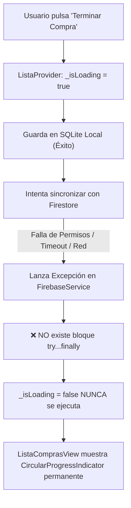

# Plan de Solución: Corrección del Bloqueo al Finalizar Lista y Reglas de Seguridad en Cloud Firestore

## 1. Diagnóstico del Problema y Aclaración sobre Firestore

### ¿Por qué NO es necesario crear "tablas" manualmente en Firestore?
A diferencia de las bases de datos relacionales tradicionales (MySQL, PostgreSQL, SQLite), **Cloud Firestore es una base de datos NoSQL documental**.
- **No existen tablas ni esquemas rígidos pre-creados.**
- Las colecciones (`listas`, `usuarios`) y sus subcolecciones (`historial`, `historial_compras`) se crean **automáticamente y bajo demanda** en el instante en que el primer documento es escrito mediante `.set()` o `.add()`.
- Por tanto, la razón por la que la pantalla se queda cargando **no es la falta de creación de tablas en la consola**.

---

### ¿Cuál es la causa real del bloqueo infinito (`_isLoading = true`)?

Se identificaron **4 causas simultáneas**:



1. **Ausencia de bloque `try...finally` en `terminarCompra()`:**
   En [`ListaProvider.terminarCompra()`](file:///c:/Users/Joan%20Marquez/Documents/GitHub/lista_supermercado/lib/providers/lista_provider.dart#L445-L503), se ejecuta `_isLoading = true; notifyListeners();`. Si ocurre cualquier error o rechazo en Firebase, la ejecución se interrumpe y `_isLoading = false;` jamás se ejecuta, dejando la vista atrapada en un spinner infinito.
2. **Llamadas a Firebase sin `timeout` ni aislamiento:**
   Las llamadas a `FirebaseService.instance.registrarCompraFinalizadaCompartida` y `syncListaCompleta` no tienen tiempo límite de espera (`.timeout(...)`). Si Firebase espera acuse de recibo de red o si la base de datos no responde, la promesa se congela.
3. **Escritura cruzada rechazada por Firestore (`batch.set` a otros usuarios):**
   En `FirebaseService.instance.registrarCompraFinalizadaCompartida`, el código intentaba un `batch.commit()` escribiendo directamente en la subcolección `/usuarios/{mUid}/historial_compras` de **otros usuarios** miembros de la lista. En Firestore, las reglas de seguridad prohíben que un usuario escriba en el perfil privado de otro (`request.auth.uid == userId`), provocando de inmediato un error `permission-denied`.
   *(Nota: Esta escritura cruzada es innecesaria porque cada dispositivo ya escucha el evento en tiempo real y guarda la compra en su propio SQLite y perfil).*
4. **Ausencia de `firestore.rules` en el repositorio:**
   Si la base de datos de Firestore en Firebase Console se encuentra en modo bloqueado (`allow read, write: if false;`) o de prueba expirado (después de 30 días), cualquier escritura es rechazada por el servidor.

---

## 2. Cambios Propuestos

### Componente 1: Resiliencia Offline-First en `ListaProvider`
#### [MODIFY] [`lib/providers/lista_provider.dart`](file:///c:/Users/Joan%20Marquez/Documents/GitHub/lista_supermercado/lib/providers/lista_provider.dart)
- Envolver `terminarCompra()` en una estructura `try ... catch ... finally` garantizando que `_isLoading = false; notifyListeners();` se ejecute **siempre**.
- Asegurar que la compra se complete localmente en SQLite al 100% (guardar historial, mover a catálogo, limpiar comprados del carrito) **antes** de intentar la nube.
- Ejecutar la sincronización con Firestore (`guardarHistorialUsuario` y `registrarCompraFinalizadaCompartida`) con un `.timeout(const Duration(seconds: 4))` y dentro de bloques `try-catch` individuales para que una falla de red o de Firebase nunca frustre la finalización de compra.
- Aplicar también `try ... finally` en `reiniciarLista()` y `vaciarListaDesdeCero()`.

### Componente 2: Corrección y Seguridad en `FirebaseService`
#### [MODIFY] [`lib/services/firebase_service.dart`](file:///c:/Users/Joan%20Marquez/Documents/GitHub/lista_supermercado/lib/services/firebase_service.dart)
- Eliminar el intento de escritura no autorizada en `/usuarios/{mUid}/historial_compras` de terceros.
- Envolver todas las operaciones de `registrarCompraFinalizadaCompartida` en `try-catch` con tiempos de espera seguros.
- Agregar tolerancia a fallos y timeouts en `syncListaCompleta`.

### Componente 3: Mejora de Experiencia de Usuario en `ListaComprasView`
#### [MODIFY] [`lib/views/lista_compras_view.dart`](file:///c:/Users/Joan%20Marquez/Documents/GitHub/lista_supermercado/lib/views/lista_compras_view.dart)
- Si el usuario pulsa "Terminar Compra" pero **no tiene ningún producto marcado como comprado** (`comprados.isEmpty`):
  Mostrar un diálogo de confirmación:
  > *"No tienes productos marcados como comprados (✓).\n¿Deseas marcar todos los productos (${pendientes.length}) como comprados y finalizar la lista, o volver para marcar solo algunos?"*
  Con opciones: **"Marcar todos y terminar"** o **"Volver a la lista"**.
- Manejar la llamada con `await` antes de desplegar el SnackBar de confirmación.

### Componente 4: Reglas de Seguridad en Cloud Firestore y Configuración
#### [NEW] [`firestore.rules`](file:///c:/Users/Joan%20Marquez/Documents/GitHub/lista_supermercado/firestore.rules)
- Archivo de reglas de seguridad robusto y optimizado:
  - **`listas/{pin}`**: Permite lectura y escritura (actualización de productos, categorías, actividad y compras finalizadas) únicamente si el PIN tiene el formato válido (4 a 8 caracteres alfanuméricos). Deniega `list` a nivel de colección para evitar enumeración global maliciosa de listas.
  - **`listas/{pin}/historial/{uuid}`**: Permite lectura y creación de compras finalizadas para miembros con el PIN.
  - **`usuarios/{userId}`** y **`usuarios/{userId}/historial_compras/{uuid}`**: Aislamiento estricto: solo el propio usuario autenticado (`request.auth.uid == userId`) puede leer o escribir sus datos personales y su historial de compras.
#### [MODIFY] [`firebase.json`](file:///c:/Users/Joan%20Marquez/Documents/GitHub/lista_supermercado/firebase.json)
- Registrar la sección `"firestore": { "rules": "firestore.rules" }` para despliegue directo con `firebase-tools`.

---

## 3. Guía para el Usuario en Firebase Console

Para que Firestore funcione al 100%, el usuario solo debe verificar 2 pasos sencillos:

1. **Crear la base de datos en Firebase Console (si no está creada):**
   - Entrar a [Firebase Console](https://console.firebase.google.com/project/smartcart-a4013/firestore).
   - Si no existe base de datos, pulsar **"Crear base de datos"** (en modo producción o prueba, ubicación cercana como `us-central` o `southamerica-east1`).
2. **Desplegar las nuevas reglas:**
   - Ejecutar en la terminal:
     ```powershell
     npx -y firebase-tools deploy --only firestore:rules
     ```
   *(O copiar y pegar el contenido de `firestore.rules` directamente en la pestaña **Rules / Reglas** de Firestore en Firebase Console).*

---

## 4. Plan de Verificación

### Pruebas Automatizadas
1. Ejecutar la suite completa de pruebas unitarias y de widgets:
   ```bash
   flutter test
   ```
2. Crear nuevas pruebas específicas en `test/lista_provider_test.dart` y `test/historial_sync_test.dart`:
   - Validar que `terminarCompra()` complete `_isLoading = false` aún si Firebase lanza excepciones de permisos o de red.
   - Validar que los productos comprados se archiven en catálogo y se vacíen del carrito local de forma offline-first.

### Verificación Manual
1. Abrir la app en un dispositivo con o sin conexión a internet.
2. Agregar productos a la lista, marcar algunos como comprados (✓) y pulsar **"Terminar Compra"**.
3. Confirmar que la pantalla se actualiza de inmediato sin colgarse en el spinner.
4. Entrar al **Historial de Compras** en el Perfil y verificar que la compra está registrada correctamente.
5. Probar con una lista compartida por PIN: verificar que el segundo dispositivo recibe la notificación y guarda la compra automáticamente en su historial.
