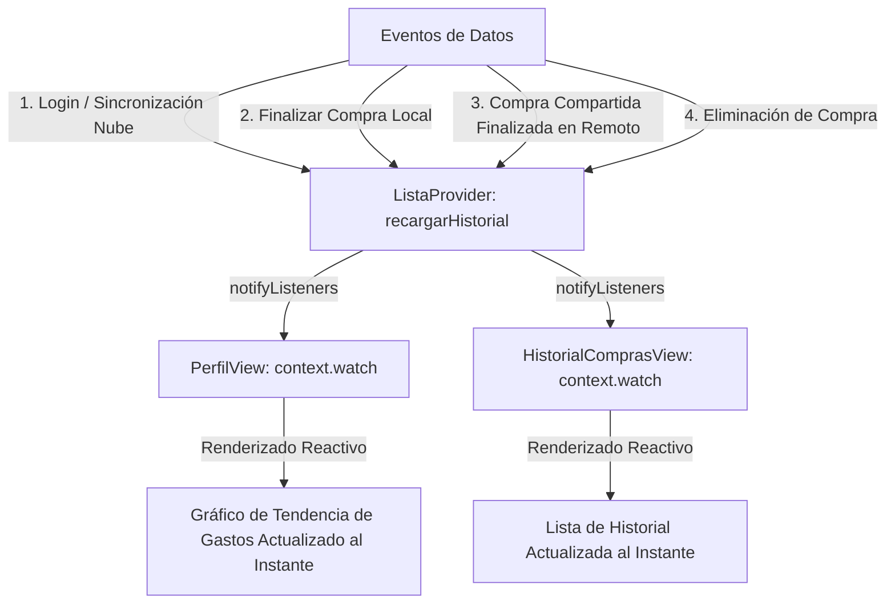

# Plan de Implementación: Animación de Cierre de Sesión y Reactividad del Gráfico de Tendencias

## 1. Diagnóstico y Objetivos

### Requerimiento 1: Animación Elegante de Cierre de Sesión
- **Problema:** Al pulsar *"Cerrar Sesión"* en `PerfilView`, los datos locales y las estadísticas se limpian asíncronamente mientras el usuario sigue viendo la pantalla, observando cómo las tarjetas caen a 0 y el perfil se reinicia antes de que `AuthGate` cambie a `LoginView`.
- **Objetivo:** Mostrar una pantalla de transición opaca a pantalla completa (`CerrandoSesionOverlay`) inmediatamente tras confirmar el diálogo, con el logo animado, indicador circular y despedida personalizada (*"¡Hasta pronto, [Nombre]!"*), ocultando al 100% el vaciado de datos y transicionando con fade a `LoginView`.

---

### Requerimiento 2: Gráfico de Tendencia de Gastos Reactivo en Tiempo Real
- **Problema:** En `PerfilView`, la lista `_historial` que alimenta el gráfico *"TENDENCIA DE GASTOS (ÚLTIMAS 5 COMPRAS)"* es un estado local desconectado cargado únicamente en `initState()` o al volver de la pantalla de Historial de Compras (`await Navigator.push(...); _cargarHistorial();`).
  - Al iniciar sesión, la descarga de la nube (`sincronizarHistorialConFirebase()`) termina después de `initState()`, por lo que el gráfico no aparece hasta reiniciar la app o entrar al historial.
  - Al realizar una compra local (`terminarCompra()`), la compra se guarda en SQLite pero `PerfilView` no actualiza su lista local.
  - Al completarse una compra compartida en otro dispositivo, se guarda en SQLite pero el gráfico en `PerfilView` tampoco se entera.
- **Objetivo:** Convertir `historial` en una propiedad observable centralizada en `ListaProvider` (`List<HistorialCompra> get historial`), sincronizada automáticamente tras:
  1. Carga inicial / inicio de sesión (`cargarListas` y `sincronizarHistorialConFirebase`).
  2. Finalización de compras locales (`terminarCompra`).
  3. Finalización de compras compartidas recibidas en tiempo real (`_escucharCambiosFirebase`).
  4. Eliminación de compras (`eliminarHistorial`).
  
  Al hacer que `PerfilView` observe `context.watch<ListaProvider>().historial`, el gráfico de tendencias se dibuja y actualiza en tiempo real de forma inmediata en todos estos escenarios.

---

## 2. Diagrama de Reactividad del Historial y Gráfico de Gastos



---

## 3. Cambios Propuestos

### Componente 1: Estado Centralizado de Historial en `ListaProvider`
#### [MODIFY] `lib/providers/lista_provider.dart`
- Agregar propiedad `List<HistorialCompra> _historial = [];` y getter `List<HistorialCompra> get historial => _historial;`.
- Crear método auxiliar `Future<void> recargarHistorial()` que lee `DBService.instance.readAllHistorial()` y notifica.
- Invocar `recargarHistorial()` en:
  - `cargarListas()` (al iniciar sesión o cambiar usuario).
  - `sincronizarHistorialConFirebase()` (después de insertar compras de la nube).
  - `terminarCompra()` (inmediatamente después de guardar la nueva compra).
  - `_escucharCambiosFirebase()` (al detectar compra compartida finalizada).
- Implementar `Future<void> eliminarHistorial(HistorialCompra h)` que elimina de SQLite y Firestore y actualiza `_historial`.
- En `limpiarDatosLocalesPorCierreDeSesion()`, vaciar `_historial.clear()`.

---

### Componente 2: Reactividad del Gráfico en `PerfilView`
#### [MODIFY] `lib/views/perfil_view.dart`
- Reemplazar la variable local aislada `_historial` por el acceso reactivo a `final historial = context.watch<ListaProvider>().historial;`.
- En `_buildChartBars()`, recibir la lista reactiva de compras para renderizar las barras de las últimas 5 compras.
- El gráfico se mostrará automáticamente en cuanto existan compras y se actualizará en vivo ante cualquier cambio en la base de datos sin requerir navegar al historial ni reiniciar la app.

---

### Componente 3: Animación Elegante de Cierre de Sesión
#### [NEW] `lib/widgets/cerrando_sesion_overlay.dart`
- `StatefulWidget` a pantalla completa con `SingleTickerProviderStateMixin`.
- `PopScope(canPop: false)` para bloquear retrocesos accidentales en Android mientras se procesa la salida.
- Diseño adaptativo con soporte para Modo Claro y Modo Oscuro (`Theme.of(context).scaffoldBackgroundColor`).
- Animación de entrada y pulso suave con el logo upright de SmartCart (`assets/icon.png`).
- Indicador de progreso circular verde (`kVerde`).
- Título *"Cerrando sesión..."*, subtítulo *"Asegurando tus datos y sincronizando..."* y despedida *"¡Hasta pronto, [Nombre]!"*.

#### [MODIFY] `lib/views/perfil_view.dart` (`_cerrarSesion`)
- En el flujo de confirmación:
  1. Abrir `CerrandoSesionOverlay` vía `rootNavigatorKey.currentState?.push(PageRouteBuilder(opaque: true, ...))`.
  2. Ejecutar concurrentemente la purga de SQLite/Provider y `AuthService.instance.signOut()`, garantizando una duración mínima estética de ~1.5 segundos.
  3. Cerrar el overlay con `rootNavigatorKey.currentState?.pop()`.
  4. Al cerrarse el overlay, `LoginView` ya se encuentra renderizado en el fondo.

---

### Componente 4: Sincronización en `HistorialComprasView`
#### [MODIFY] `lib/views/historial_compras_view.dart`
- Aprovechar `context.watch<ListaProvider>().historial` o sincronizar la eliminación con `provider.eliminarHistorial(h)` para que cualquier eliminación en el historial se refleje instantáneamente en el gráfico de perfil.

---

### Componente 5: Pruebas Automatizadas
#### [NEW] `test/logout_animation_test.dart`
- Comprobar que `CerrandoSesionOverlay` se renderice adecuadamente con el nombre de usuario y que `PopScope` bloquee el pop.
#### [MODIFY] `test/historial_sync_test.dart`
- Comprobar que `ListaProvider.historial` empiece vacío y se actualice reactivamente.

---

## 4. Plan de Verificación

### Pruebas Automatizadas
```powershell
flutter analyze
flutter test
```
- Verificar que las pruebas existentes (43/43) y las nuevas pruebas pasen al 100%.
- Asegurar 0 errores y 0 advertencias en el análisis estático.

### Pruebas Manuales en el Emulador
1. **Gráfico de Tendencias en Tiempo Real:**
   - Iniciar sesión -> El gráfico de tendencias debe aparecer de inmediato con las compras de la nube sin tener que abrir el historial.
   - Realizar una compra local en "Mi Lista" -> Al volver a "Perfil", el gráfico debe mostrar la nueva compra inmediatamente reflejada.
   - Si se finaliza una compra compartida desde otro teléfono -> El participante debe ver la barra añadida a su gráfico de perfil en tiempo real.
2. **Animación de Cierre de Sesión:**
   - Ir a "Perfil" -> Tocar "Cerrar sesión" -> Confirmar.
   - La pantalla animada debe cubrir toda la UI de inmediato (incluida la barra inferior).
   - Verificar que no se observe parpadeo ni el vaciado de las estadísticas en pantalla.
   - Al terminar la animación (~1.5s), debe revelar suavemente la pantalla de Login limpia.
