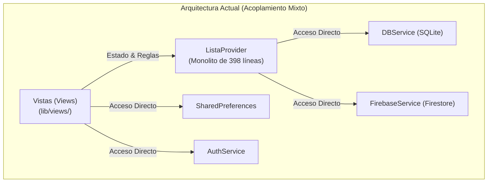
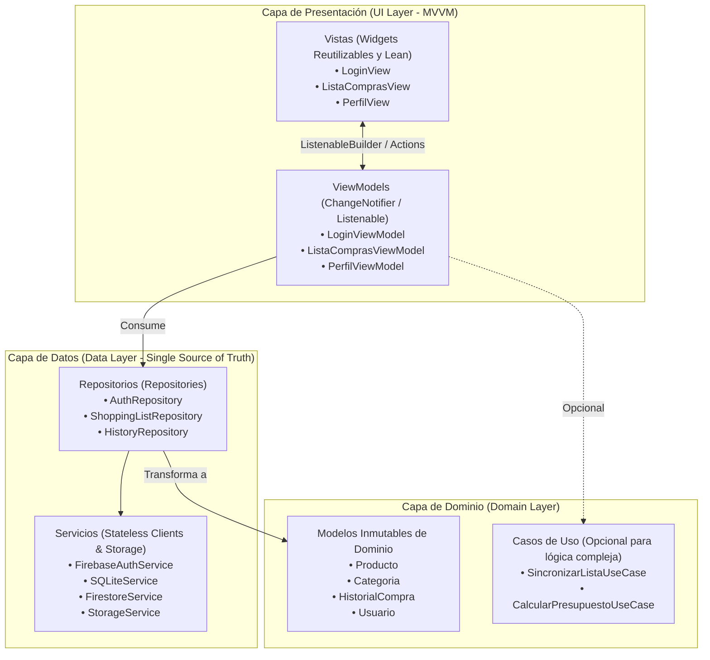
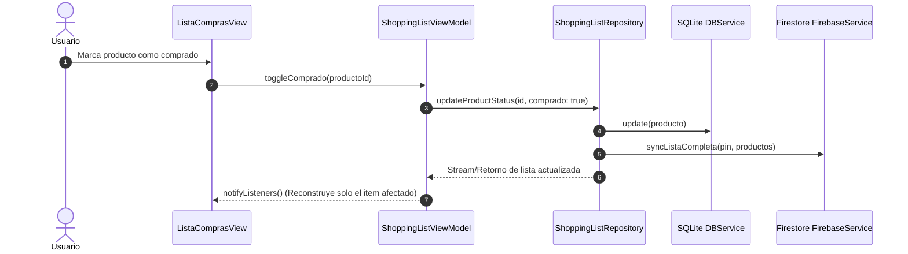

# Plan de Arquitectura y Diagnóstico Técnico: SmartCart

Este documento presenta el diagnóstico arquitectónico de la aplicación **SmartCart** y la propuesta de modernización basada en las **mejores prácticas de arquitectura recomendadas para Flutter (Capas UI, Dominio y Datos con patrón MVVM y Repositorios)**.

---

## 1. Diagnóstico del Estado Actual

Actualmente, el proyecto cuenta con una estructura funcional basada en `Provider` y servicios centralizados, pero presenta acoplamientos típicos de proyectos en crecimiento:



### Hallazgos Principales

> [!WARNING] **Monolito en `ListaProvider`**
> [`ListaProvider`](file:///c:/Users/Joan%20Marquez/Documents/GitHub/lista_supermercado/lib/providers/lista_provider.dart) asume múltiples responsabilidades simultáneas:
> 1. CRUD de base de datos local SQLite ([`DBService`](file:///c:/Users/Joan%20Marquez/Documents/GitHub/lista_supermercado/lib/services/db_service.dart)).
> 2. Algoritmo de sincronización y resolución de conflictos en tiempo real con Firestore ([`FirebaseService`](file:///c:/Users/Joan%20Marquez/Documents/GitHub/lista_supermercado/lib/services/firebase_service.dart)).
> 3. Cálculos de presupuesto y totales de compra.
> 4. Gestión de catálogo de productos base y categorías.
> 5. Notificación reactiva a los widgets de la UI.

> [!WARNING] **Lógica de Negocio y Persistencia en Vistas**
> Archivos como [`perfil_view.dart`](file:///c:/Users/Joan%20Marquez/Documents/GitHub/lista_supermercado/lib/views/perfil_view.dart) realizan operaciones de almacenamiento en disco (`File.copy`), lecturas de `SharedPreferences`, llamadas directas a `launchUrl` e interactúan con la cámara/galería directamente en el estado del widget (`State<PerfilView>`), dificultando las pruebas unitarias aisladas.

---

## 2. Arquitectura Objetivo: Capas Estrictas

La arquitectura objetivo implementa el principio de **Separación de Responsabilidades** dividiendo la app en 3 capas bien definidas:



### Responsabilidad de Cada Capa

1. **Capa UI (Presentación - MVVM):**
   - **Vistas:** Widgets puramente declarativos. No contienen llamadas a APIs ni bases de datos. Reaccionan al ViewModel mediante `ListenableBuilder` o `Consumer`.
   - **ViewModels:** Heredan de `ChangeNotifier`. Exponen estado inmutable hacia la vista y procesan eventos del usuario ejecutando métodos en los Repositorios.

2. **Capa de Dominio (Domain):**
   - Contiene las entidades puras de negocio ([`Producto`](file:///c:/Users/Joan%20Marquez/Documents/GitHub/lista_supermercado/lib/models/producto.dart), [`CategoriaModel`](file:///c:/Users/Joan%20Marquez/Documents/GitHub/lista_supermercado/lib/models/categoria_model.dart), [`HistorialCompra`](file:///c:/Users/Joan%20Marquez/Documents/GitHub/lista_supermercado/lib/models/historial_compra.dart)).
   - No tiene dependencias de Flutter UI (`BuildContext`, `Theme`, `ScaffoldMessenger`).

3. **Capa de Datos (Data - Repositorios & Servicios):**
   - **Servicios:** Clases sin estado que envuelven librerías externas (`sqflite`, `cloud_firestore`, `firebase_auth`, `google_sign_in`).
   - **Repositorios:** Implementan la lógica de **Fuente Única de Verdad (Single Source of Truth)**. Unifican los datos locales de SQLite con la sincronización en la nube de Firebase, resolviendo diferencias y entregando al ViewModel datos listos para consumir.

---

## 3. Estructura de Directorios Recomendada

La estructura híbrida recomendada organiza la UI por **características (features)** y los datos/dominio por **tipo**:

```text
lib/
├── data/
│   ├── models/                  # DTOs / Mapeadores de SQLite y Firestore
│   ├── repositories/            # Implementaciones de Repositorios
│   │   ├── auth_repository.dart
│   │   ├── shopping_list_repository.dart
│   │   └── history_repository.dart
│   └── services/                # Envoltorios de plugins externos y almacenamiento
│       ├── auth_service.dart
│       ├── db_service.dart
│       ├── firebase_service.dart
│       └── preferences_service.dart
│
├── domain/
│   ├── models/                  # Entidades limpias del dominio
│   │   ├── producto.dart
│   │   ├── categoria_model.dart
│   │   └── historial_compra.dart
│   └── use_cases/               # Lógica reutilizable entre ViewModels
│       └── sync_shopping_list_use_case.dart
│
├── ui/
│   ├── core/                    # Componentes compartidos, temas y utilidades visuales
│   │   ├── theme/
│   │   │   └── colors.dart
│   │   └── widgets/
│   │       ├── auth_gate.dart
│   │       ├── google_logo.dart
│   │       ├── producto_card.dart
│   │       └── barra_progreso_presupuesto.dart
│   │
│   └── features/                # Módulos organizados por funcionalidad
│       ├── auth/
│       │   ├── view_models/login_view_model.dart
│       │   └── views/login_view.dart
│       │
│       ├── shopping_list/
│       │   ├── view_models/shopping_list_view_model.dart
│       │   └── views/lista_compras_view.dart
│       │
│       ├── voice_input/
│       │   ├── view_models/voice_input_view_model.dart
│       │   └── views/agregar_voz_view.dart
│       │
│       ├── categories/
│       │   ├── view_models/categories_view_model.dart
│       │   └── views/categorias_view.dart
│       │
│       ├── profile/
│       │   ├── view_models/profile_view_model.dart
│       │   └── views/perfil_view.dart
│       │
│       └── history/
│           ├── view_models/history_view_model.dart
│           └── views/historial_compras_view.dart
│
├── firebase_options.dart
└── main.dart
```

---

## 4. Flujo de Datos: Ejemplo de Lista de Compras y Sincronización

Este diagrama ilustra cómo fluyen los datos sin mezclar responsabilidades:



---

## 5. Hoja de Ruta de Migración (4 Fases)

Para evitar roturas y mantener la app siempre operativa y ejecutable:

### Fase 1: Creación de Repositorios (Sin alterar Vistas)
- [ ] Crear [`lib/data/repositories/auth_repository.dart`](file:///c:/Users/Joan%20Marquez/Documents/GitHub/lista_supermercado/lib/services/auth_service.dart) abstrayendo [`AuthService`](file:///c:/Users/Joan%20Marquez/Documents/GitHub/lista_supermercado/lib/services/auth_service.dart) y `SharedPreferences`.
- [ ] Crear `ShoppingListRepository` extrayendo la lógica de diffing y persistencia que hoy reside dentro de [`ListaProvider`](file:///c:/Users/Joan%20Marquez/Documents/GitHub/lista_supermercado/lib/providers/lista_provider.dart).
- [ ] Refactorizar [`ListaProvider`](file:///c:/Users/Joan%20Marquez/Documents/GitHub/lista_supermercado/lib/providers/lista_provider.dart) para que delegue en `ShoppingListRepository` en lugar de llamar directamente a SQLite y Firebase.

### Fase 2: Implementación de ViewModels (MVVM)
- [ ] Crear `LoginViewModel` desacoplando los estados de carga y validaciones de [`LoginView`](file:///c:/Users/Joan%20Marquez/Documents/GitHub/lista_supermercado/lib/views/login_view.dart).
- [ ] Crear `ProfileViewModel` extrayendo el manejo de fotos locales, emojis y SMS de [`PerfilView`](file:///c:/Users/Joan%20Marquez/Documents/GitHub/lista_supermercado/lib/views/perfil_view.dart).
- [ ] Crear `ShoppingListViewModel` para desacoplar filtros y búsquedas de [`ListaComprasView`](file:///c:/Users/Joan%20Marquez/Documents/GitHub/lista_supermercado/lib/views/lista_compras_view.dart).

### Fase 3: Reorganización de Carpetas
- [ ] Mover modelos de `lib/models/` a `lib/domain/models/`.
- [ ] Mover servicios de `lib/services/` a `lib/data/services/`.
- [ ] Mover vistas y widgets a `lib/ui/features/` y `lib/ui/core/`.
- [ ] Actualizar rutas relativas de imports con soporte de `dart fix` / análisis estático.

### Fase 4: Pruebas Unitarias de Arquitectura
- [ ] Pruebas unitarias para `ShoppingListRepository` usando mocks en memoria.
- [ ] Pruebas unitarias para `AuthRepository` y sus ViewModels asociados.
- [ ] Validación global con `flutter analyze` y `flutter test`.

---

> [!TIP] **Ventajas Directas para SmartCart**
> 1. **Facilidad para Testear:** Los repositorios y ViewModels se pueden probar al 100% sin levantar emuladores ni depender de conexiones de red reales.
> 2. **Sincronización Robusta:** Los conflictos entre la lista local y la nube quedan aislados en un solo lugar (`ShoppingListRepository`).
> 3. **Código Limpio:** Vistas de menos de 150 líneas, fáciles de leer y mantener.
