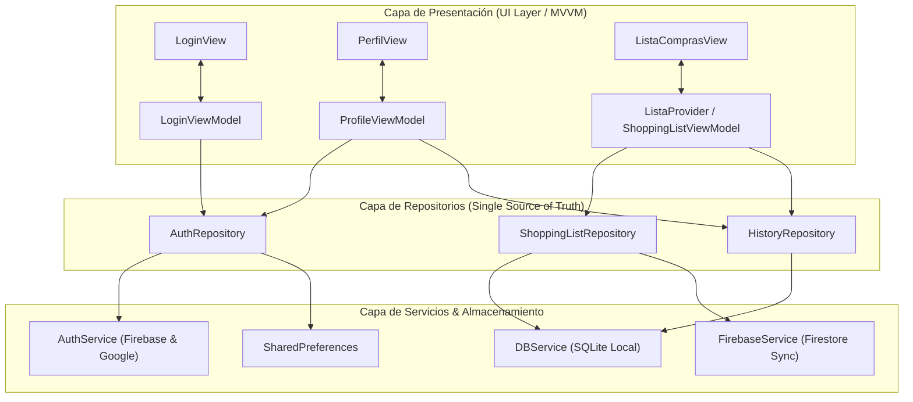

# Plan de Implementación: Refactorización a Arquitectura por Capas y MVVM en SmartCart

## Descripción del Objetivo

El objetivo de esta intervención es modernizar la arquitectura de **SmartCart** adoptando las mejores prácticas oficiales de Flutter:
1. **Separación de Responsabilidades:** Aislar la lógica de acceso a datos y sincronización de la capa de presentación.
2. **Capa de Repositorios (Data Layer):** Crear `AuthRepository`, `ShoppingListRepository` y `HistoryRepository` como **fuente única de verdad**, desacoplando `ListaProvider` de las llamadas directas a SQLite y Firebase Firestore.
3. **Patrón MVVM (UI Layer):** Implementar ViewModels (`LoginViewModel`, `ProfileViewModel`) que extiendan de `ChangeNotifier`, exponiendo estado inmutable a las vistas mediante `ListenableBuilder` / `Consumer`.
4. **Mantenimiento de Compatibilidad:** Garantizar que la aplicación siga funcionando sin interrupciones durante y después de la refactorización, verificando cada paso con `flutter analyze` y `flutter test`.

---

## Revisión del Usuario Requerida

> [!IMPORTANT]
> **Estrategia de Refactorización Sin Roturas (Non-Breaking Migration)**
> Para proteger la estabilidad de la aplicación, mantendremos las firmas públicas de `ListaProvider` mientras delegamos internamente su persistencia y sincronización a los nuevos repositorios. De este modo, las pantallas que aún consumen `ListaProvider` (`ListaComprasView`, `AgregarVozView`, `CategoriasView`) seguirán operando al 100% sin necesidad de reescribirlas todas de golpe.

> [!NOTE]
> **Estructura de Directorios Progresiva**
> Los nuevos componentes se ubicarán directamente en las carpetas canónicas (`lib/data/repositories/`, `lib/ui/features/.../view_models/`), facilitando que el resto de las vistas se migren paulatinamente.

---

## Preguntas Abiertas

> [!TIP]
> No hay bloqueos técnicos en este momento. La suite de pruebas actual pasa al 100% y el análisis estático no tiene errores. El plan está estructurado para ejecutarse inmediatamente tras tu confirmación.

---

## Diagrama de la Arquitectura Objetivo



---

## Cambios Propuestos

### 1. Capa de Datos: Repositorios

#### [NEW] `lib/data/repositories/auth_repository.dart`
- Encapsula las operaciones de autenticación y persistencia de sesión:
  - `Stream<User?> get authStateChanges`
  - `User? get currentUser`
  - `bool get isAuthenticated`
  - `Future<bool> isGuestMode()`
  - `Future<void> setGuestMode(bool enabled)`
  - `Future<UserCredential> signInWithEmail(...)`
  - `Future<UserCredential> registerWithEmail(...)`
  - `Future<UserCredential?> signInWithGoogle()`
  - `Future<void> sendPasswordReset(...)`
  - `Future<void> signOut()`

#### [NEW] `lib/data/repositories/shopping_list_repository.dart`
- Extrae la lógica de almacenamiento local y sincronización en la nube que actualmente está dentro de `ListaProvider`:
  - `Future<List<Producto>> getProductos()`
  - `Future<Producto> addProducto(Producto p, {String? pin})`
  - `Future<void> updateProducto(Producto p, {String? pin})`
  - `Future<void> deleteProducto(dynamic idOrUuid, {String? pin})`
  - `Stream<List<Producto>> streamCloudList(String pin)`
  - Algoritmo de sincronización bidireccional y resolución de conflictos entre SQLite y Firestore.

#### [NEW] `lib/data/repositories/history_repository.dart`
- Encapsula la persistencia y lectura de compras completadas:
  - `Future<List<HistorialCompra>> getAllHistorial()`
  - `Future<void> saveHistorial(HistorialCompra h)`

---

### 2. Capa de Presentación: ViewModels (MVVM)

#### [NEW] `lib/ui/features/auth/view_models/login_view_model.dart`
- Administra el estado del formulario de inicio de sesión y registro:
  - Propiedades: `isLogin`, `isLoading`, `isGoogleLoading`, `obscurePassword`, `errorMessage`, `successMessage`.
  - Métodos: `toggleAuthMode()`, `togglePasswordVisibility()`, `submitEmailAuth()`, `signInWithGoogle()`, `sendPasswordReset()`.

#### [MODIFY] `lib/views/login_view.dart`
- Conectar la vista para que consuma `LoginViewModel` mediante `ListenableBuilder`, dejando la vista como un componente puramente declarativo y libre de llamadas directas a Firebase.

#### [NEW] `lib/ui/features/profile/view_models/profile_view_model.dart`
- Administra el estado del perfil de usuario:
  - Propiedades: `nombre`, `email`, `rol`, `emoji`, `fotoPath`, `telefonoSMS`, `notificacionesActivas`, `historial`, `isGoogleUser`, `isGuest`.
  - Métodos: `cargarDatos()`, `guardarDatos()`, `actualizarFoto()`, `cerrarSesion()`.

#### [MODIFY] `lib/views/perfil_view.dart`
- Desacoplar la persistencia en disco y `SharedPreferences` delegándola en `ProfileViewModel`.

#### [MODIFY] `lib/providers/lista_provider.dart`
- Inyectar `ShoppingListRepository` y `HistoryRepository` en su constructor.
- Delegar las operaciones de lectura, escritura y escucha remota al repositorio, manteniendo su interfaz externa intacta para no romper ninguna vista dependiente.

#### [MODIFY] `lib/main.dart`
- Registrar los repositorios y ViewModels en el árbol de dependencias (`MultiProvider`).

---

### 3. Pruebas Unitarias y de Integración

#### [NEW] `test/auth_repository_test.dart`
- Verificación del comportamiento del repositorio de autenticación y gestión del modo invitado.

#### [NEW] `test/login_view_model_test.dart`
- Verificación del cambio de estado, validaciones y manejo de errores del ViewModel de Login.

#### [MODIFY] `test/login_view_test.dart`
- Asegurar compatibilidad de las pruebas de widget existentes con el nuevo ViewModel.

---

## Plan de Verificación

### Pruebas Automatizadas
1. **Análisis Estático:**
   ```powershell
   flutter analyze
   ```
   *Criterio de éxito:* 0 errores y 0 advertencias (`No issues found!`).

2. **Suite Completa de Pruebas Unitarias y de Widgets:**
   ```powershell
   flutter test
   ```
   *Criterio de éxito:* 100% de las pruebas pasadas (tanto las 7 pruebas actuales como las nuevas pruebas de repositorios y ViewModels).

3. **Verificación de Compilación de Bundle:**
   ```powershell
   flutter build bundle
   ```
   *Criterio de éxito:* Código de salida `0`.

### Verificación Manual
1. Iniciar la aplicación y comprobar que la pantalla de Login responde con la misma fluidez visual, alternando entre Iniciar Sesión y Registro.
2. Iniciar sesión o pulsar "Continuar como invitado" y confirmar navegación fluida a la lista de compras.
3. Ir a la pestaña "Perfil", editar datos y verificar que se reflejan de inmediato.
4. Pulsar "Cerrar sesión" y verificar que el diálogo de confirmación funciona y redirige a la pantalla de Login.
