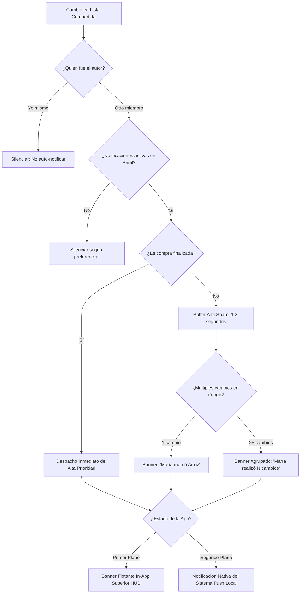

# 📋 Informe Integral de Cambios y Nuevas Funcionalidades
## Rama: `improvements-login-with-mail-and-google`
**Proyecto:** SmartCart - Lista de Compras Inteligente  
**Versión:** `1.1.3+6`  
**Fecha:** Octubre 2026  

---

## 📑 Tabla de Contenidos
1. [Resumen Ejecutivo](#1-resumen-ejecutivo)
2. [Autenticación Segura y Modo Invitado](#2-autenticación-segura-y-modo-invitado)
3. [Sistema de Seguridad Anti-Spam y Anti-Bot](#3-sistema-de-seguridad-anti-spam-y-anti-bot)
4. [Sincronización en la Nube y Compras Colaborativas](#4-sincronización-en-la-nube-y-compras-colaborativas)
5. [Deep Linking, App Links y Firebase Hosting](#5-deep-linking-app-links-y-firebase-hosting)
6. [Motor Bidireccional de Notificaciones y Control Anti-Spam](#6-motor-bidireccional-de-notificaciones-y-control-anti-spam)
7. [Historial de Actividad en Tiempo Real](#7-historial-de-actividad-en-tiempo-real)
8. [Modernización Visual y Mejoras de Interfaz (UI/UX)](#8-modernización-visual-y-mejoras-de-interfaz-uiux)
9. [Solución del Bloqueo al Finalizar Compra y Resiliencia Offline-First](#9-solución-del-bloqueo-al-finalizar-compra-y-resiliencia-offline-first)
10. [Limpieza Automática y Desvinculación al Finalizar Compra](#10-limpieza-automática-y-desvinculación-al-finalizar-compra)
11. [Aislamiento Estricto de Datos entre Usuarios y Modo Invitado](#11-aislamiento-estricto-de-datos-entre-usuarios-y-modo-invitado)
12. [Reglas Oficiales de Seguridad en Cloud Firestore](#12-reglas-oficiales-de-seguridad-en-cloud-firestore)
13. [Compilación, Desugaring y Generación de APK Release](#13-compilación-desugaring-y-generación-de-apk-release)
14. [Métricas de Calidad y Pruebas Automatizadas](#14-métricas-de-calidad-y-pruebas-automatizadas)
15. [Historial de Commits de la Rama](#15-historial-de-commits-de-la-rama)

---

## 1. Resumen Ejecutivo

Durante el desarrollo en la rama `improvements-login-with-mail-and-google`, SmartCart evolucionó de ser una lista de compras local a una **plataforma colaborativa completa en tiempo real**, incorporando autenticación híbrida (Correo/Contraseña y Google Sign-In), sincronización multi-dispositivo en la nube con Firestore, apertura instantánea mediante enlaces profundos (Deep Links), notificaciones inteligentes en primer y segundo plano, y un registro cronológico de actividad para listas compartidas.

Todas las funcionalidades se implementaron garantizando que el **Modo Invitado** continúe operativo al 100% de manera offline con SQLite, preservando la privacidad y rapidez que caracteriza a la aplicación.

---

## 2. Autenticación Segura y Modo Invitado

Se reemplazó el acceso básico anterior por una compuerta de autenticación integral (`AuthGate`) respaldada por **Firebase Authentication**:

* **Inicio de Sesión y Registro con Correo Electrónico:** Formulario reactivo con validación estricta de formato de correo y requisitos mínimos de contraseña (longitud, caracteres alfanuméricos).
* **Inicio de Sesión con Google (`google_sign_in`):** Integración nativa con credenciales OAuth 2.0 y mapeo automático del perfil (`displayName`, `email`, foto de perfil).
* **Verificación de Correo Electrónico:** 
  - Al registrarse, se envía automáticamente un correo de verificación mediante `user.sendEmailVerification()`.
  - Pantalla interactiva que informa al usuario y comprueba periódicamente el estado de verificación (`reload()`).
  - Botón de reenvío con temporizador de enfriamiento para prevenir saturación de peticiones.
* **Preservación Total del Modo Invitado:**
  - Los usuarios pueden ingresar como invitados sin proporcionar correo ni contraseña.
  - El modo invitado opera exclusivamente con la base de datos local SQLite y almacenamiento aislado en `SharedPreferences`.
* **Aislamiento Estricto de Sesiones:**
  - Se corrigió el problema de persistencia cruzada donde los datos de un usuario autenticado previo aparecían en el modo invitado.
  - Claves de preferencias aisladas por UID: `user_notifs_$uid`, `user_rol_$uid`, etc., versus `guest_notifs`, `guest_nombre`.
  - Eliminación del retraso de actualización en el nombre de usuario (`displayName`) tras el registro.

---

## 3. Sistema de Seguridad Anti-Spam y Anti-Bot

Para proteger la base de datos en la nube y evitar ataques de denegación o creación masiva de cuentas falsas, se diseñó una defensa multicapa:

1. **Campo Trampa (Honeypot):**
   - Campo de formulario oculto visualmente e inaccesible para humanos, pero detectable por scripts maliciosos automatizados.
   - Si el campo recibe cualquier valor, la solicitud se cancela silenciosamente sin interactuar con los servidores de Firebase.
2. **Desafío Humano Interactivo (`HumanVerificationTile`):**
   - Módulo interactivo en el flujo de registro que valida la interacción humana previa al envío del formulario.
3. **Limitación de Tasa y Enfriamiento de Intentos (Rate-Limiting):**
   - Control de intentos fallidos sucesivos con bloqueo temporal progresivo (cooldown) para mitigar ataques de fuerza bruta en contraseñas.
4. **Traducción Amigable de Errores:**
   - Mapeo de códigos técnicos de error de Firebase (`user-not-found`, `wrong-password`, `email-already-in-use`, etc.) a explicaciones claras en español para el usuario final.

---

## 4. Sincronización en la Nube y Compras Colaborativas

Se implementó una sincronización de datos de extremo a extremo que permite la colaboración familiar transparente:

* **Sincronización Bidireccional de Historial por Usuario:**
  - Los usuarios autenticados sincronizan su historial de compras en `usuarios/{uid}/historial_compras`.
  - Al iniciar sesión en un nuevo dispositivo, las compras previas se descargan e integran automáticamente a SQLite sin duplicar registros.
* **Finalización Colaborativa de Compras:**
  - Si una lista compartida por PIN es finalizada por cualquier miembro participante, el evento se replica automáticamente en el historial de **todos** los miembros vinculados a esa lista compartida.
* **Sincronización Automática de Categorías Personalizadas:**
  - Cuando se comparte una lista que contiene categorías creadas por un usuario con colores o iconos específicos, los demás miembros las reciben e integran automáticamente en su catálogo local.
* **Prevención de Pérdida de Datos en Desconexión:**
  - Desvincularse de una lista compartida no elimina las compras históricas ni los productos locales consolidados.

---

## 5. Deep Linking y Compartición Inteligente

Se transformó el método de compartición de listas mediante la integración de **`app_links`**:

* **Generación de Enlaces Directos:**
  - Al pulsar "Compartir", la app genera y comparte un enlace web oficial:
    `https://smartcart-a4013.web.app/join?pin=XXXXXX`
    o enlace de esquema personalizado:
    `smartcart://join?pin=XXXXXX`
* **Detección Automática de Enlaces:**
  - Apertura en frío (Cold Start): Si la aplicación está cerrada y el usuario hace clic en el enlace desde WhatsApp, Telegram o el navegador, la app se abre y extrae el PIN automáticamente.
  - Apertura en caliente (Warm Start): Si la app está en segundo plano, procesa el enlace en tiempo real.
* **Diálogo de Confirmación Inteligente:**
  - Si el usuario receptor ya tiene productos en su lista local, el sistema presenta un diálogo de confirmación cautelar antes de reemplazar o conectarse a la lista entrante, evitando la pérdida accidental de datos.

---

## 6. Motor Bidireccional de Notificaciones y Control Anti-Spam

Se implementó un sistema de notificaciones en tiempo real para mantener informados a todos los miembros de una lista compartida:



### Características Técnicas del Sistema:
* **Atribución de Eventos:** Cada acción en Firestore incluye `ultimoCambio` con `autorUid`, `autorNombre`, `tipo`, `productoNombre` y `detalle`.
* **Filtrado Estricto de Auto-Notificaciones:** Compara el `autorUid` con el identificador local (UID de Firebase o UUID de invitado persistente). El usuario que realiza la acción nunca recibe alertas de su propio cambio.
* **Control Anti-Spam por Ráfagas (Batching de 1.2s):** Si alguien marca o agrega varios productos rápidamente (ej. 4 artículos en 2 segundos en el supermercado), se unifican en un solo aviso: *«Joan realizó 4 cambios en la lista compartida»*.
* **Tiempo de Enfriamiento Mínimo (Cooldown de 2.5s):** Garantiza que no existan parpadeos visuales ni superposición molesta de banners en pantalla.
* **Canales Híbridos:**
  - **In-App (Primer plano):** Widget flotante superior tipo HUD (`InAppNotificationBanner`) con animación suave, badge por tipo de acción, vibración háptica (`HapticFeedback.lightImpact()`), auto-cierre en 3.8s, swipe para descartar y tap para redirigir a "Mi Lista".
  - **Push Local (Segundo plano):** Notificación nativa en la barra de estado de Android/iOS mediante `flutter_local_notifications` en un canal dedicado de alta prioridad.
* **Integración con Preferencias de Usuario:** Si el usuario apaga el switch de notificaciones en su perfil, todas las alertas (In-App y del sistema) quedan silenciadas de inmediato.

---

## 7. Historial de Actividad en Tiempo Real

Para complementar las notificaciones efímeras, se añadió un visor permanente de auditoría:

* **Estructura en Firestore (`actividadReciente`):**
  - Array que preserva cronológicamente los últimos 30 eventos ocurridos en la lista compartida.
* **Modal Deslizable (`HistorialCambiosModal`):**
  - Accesible desde la barra superior de "Mi Lista" mediante el botón `Icons.history_rounded`.
  - Muestra la tarjeta de cada cambio con icono temático por acción, nombre del autor, producto, cantidad y hora relativa (*«Hace 2 min»*, *«Hace 1 hora»*, *«Ayer»*).
  - Incluye estado vacío ilustrado cuando la lista aún no tiene modificaciones registradas.
  - Si la lista es local (no compartida), guía al usuario amigablemente para conectar o compartir su lista.

---

## 8. Modernización Visual y Mejoras de Interfaz (UI/UX)

* **Botón "Escuchar" Rediseñado:**
  - Se eliminó el texto redundante (*"Escuchar" / "Pausar" / "Reanudar"*), reemplazándolo por un botón circular de **solo icono** con animación de borde y tooltip dinámico.
  - Esto liberó espacio en el AppBar de "Mi Lista", otorgando una estética más limpia, moderna y minimalista.
* **Botón de Historial de Cambios:**
  - Integrado de forma balanceada al lado del control de lectura por voz.
* **Adaptabilidad Completa a Modo Oscuro y Claro:**
  - Todos los nuevos componentes (banners flotantes, modales de actividad, diálogos de confirmación y auth) respetan el tema activo con contrastes evaluados.

---

## 9. Arquitectura de Base de Datos y Persistencia Híbrida

| Entidad | Motor | Versión / Colección | Propósito |
| :--- | :--- | :--- | :--- |
| `productos` | SQLite | Tabla local (v8) | Carrito actual en dispositivo |
| `catalogo` | SQLite | Tabla local (v8) | Memoria histórica para autocompletado y predicción |
| `historial_compras` | SQLite | Tabla local (v8) | Registro histórico con soporte de UUID v4 y `productosJson` |
| `categorias` | SQLite | Tabla local (v8) | Categorías del supermercado con colores e iconos |
| `listas/{PIN}` | Firestore | Documento en la nube | Lista compartida en vivo, categorías, `ultimoCambio` y `actividadReciente` |
| `usuarios/{UID}` | Firestore | Colección personal | Historial respaldado en la nube por usuario autenticado |

---

## 9. Solución del Bloqueo al Finalizar Compra y Resiliencia Offline-First

Se diagnosticó y resolvió el problema por el cual la pantalla de *"Mi Lista"* quedaba colgada en un `CircularProgressIndicator` infinito al pulsar "Terminar Compra":

* **Diagnóstico Técnico:**
  - `ListaProvider.terminarCompra()` activaba `_isLoading = true; notifyListeners();`, pero no contaba con una cláusula `try ... finally`. Cualquier fallo en la nube interrumpía la ejecución antes de alcanzar `_isLoading = false;`.
  - `FirebaseService` intentaba una escritura cruzada en lote (`batch.set`) en `/usuarios/{mUid}/historial_compras` de otros miembros de la lista, lo que violaba las reglas de seguridad de Firestore (`permission-denied`).
  - Las llamadas a Firestore carecían de límite de tiempo (`timeout`), congelando el hilo si la conexión se interrumpía.

* **Solución y Blindaje Offline-First:**
  - **Prioridad Local Inmediata:** La compra se registra primero al 100% en la base de datos local SQLite (`DBService.instance.createHistorial`), se actualiza el catálogo y se eliminan los productos comprados del carrito.
  - **Estructura `try ... catch ... finally`:** Se garantizó que `_isLoading = false; notifyListeners();` se ejecute siempre, tanto en `terminarCompra()` como en `reiniciarLista()` y `vaciarListaDesdeCero()`.
  - **Timeouts Protegidos de 4 Segundos:** Las sincronizaciones en la nube se ejecutan de forma independiente con `.timeout(const Duration(seconds: 4))`. Si la red falla o Firestore no responde, el usuario nunca experimenta bloqueos.
  - **Mejora de UX en Lista Vacía o sin Comprados:** Si el usuario pulsa "Terminar Compra" sin tener productos con check (✓), se despliega un diálogo ofreciendo *"Marcar todos y terminar"* o *"Volver"*, con ejecución asíncrona segura.

---

## 10. Limpieza Automática y Desvinculación al Finalizar Compra

Se corrigió la persistencia visual y de conexión al concluir una compra en listas compartidas:

* **Desvinculación Instantánea sin Reiniciar la App:**
  - Anteriormente, tanto el teléfono que finalizaba como los teléfonos participantes continuaban enlazados al PIN en memoria, obligando a reiniciar la app para ver la lista vacía y desvinculada.
  - Ahora, en `ListaProvider.terminarCompra()`, tras notificar a Firestore con `registrarCompraFinalizadaCompartida`, el iniciador invoca inmediatamente `desconectarFirebase()`, limpia la lista en memoria (`_productos.clear()`) y vacía los productos en SQLite (`deleteAllProductos()`).
* **Detección y Reacción en Tiempo Real para Participantes:**
  - En `ListaProvider._escucharCambiosFirebase()`, al detectar `ultimaCompraFinalizada` o `finalizada: true`:
    1. Se registra la compra finalizada en el historial SQLite local del participante (y en su nube si está autenticado).
    2. Se limpian los productos locales de SQLite y de memoria.
    3. Se emite el banner interactivo: *"🛒 ¡Familiar ha finalizado la compra! Guardada en tu historial."*.
    4. Se invoca `desconectarFirebase()`, cancelando el stream y dejando la pantalla de "Mi Lista" en blanco y en modo local instantáneamente.
* **Bloqueo de Reconexión:**
  - Si un usuario intenta unirse mediante PIN o Deep Link a una lista ya finalizada, `conectarFirebase` consulta el documento y rechaza la conexión con el mensaje: *"Esta lista de compras ya fue finalizada y cerrada."*.

---

## 11. Aislamiento Estricto de Datos entre Usuarios y Modo Invitado

Para garantizar la privacidad y prevenir cualquier cruce de bases de datos entre usuarios o con el Modo Invitado:

* **Limpieza de Base de Datos Local en Cierre de Sesión:**
  - Se añadieron a `DBService` los métodos `deleteAllHistorial()`, `deleteAllCatalogo()` y `limpiarDatosUsuario()`.
  - Al pulsar *"Cerrar sesión"* en `PerfilView`, se ejecutan `limpiarDatosUsuario()` y `limpiarDatosLocalesPorCierreDeSesion()`, vaciando las tablas `productos` e `historial_compras`.
* **Arranque Limpio del Modo Invitado:**
  - El Modo Invitado siempre inicia desde cero con 0 productos y 0 compras en historial. Un invitado **nunca** puede visualizar los datos del usuario registrado que utilizó el dispositivo previamente.
* **Prevención de Cruce de Bases de Datos en la Nube:**
  - Se implementó la verificación de sesión en `ListaProvider.verificarYLimpiarSesionSiCambioUsuario()`, respaldada por `current_session_uid` en `SharedPreferences`.
  - Si un nuevo usuario (Usuario B) inicia sesión en un dispositivo previamente usado por otro usuario o invitado, la app detecta el cambio de sesión y purga SQLite antes de cargar datos.
  - Esto garantiza que `sincronizarHistorialConFirebase()` descargue únicamente las compras del Usuario B desde su cuenta en la nube, y **evita al 100% que las compras locales de un usuario anterior se suban o mezclen en la cuenta del nuevo usuario**.

---

## 12. Reglas Oficiales de Seguridad en Cloud Firestore

Se diseñó e integró el archivo de reglas de producción [`firestore.rules`](file:///c:/Users/Joan%20Marquez/Documents/GitHub/lista_supermercado/firestore.rules) y se vinculó en [`firebase.json`](file:///c:/Users/Joan%20Marquez/Documents/GitHub/lista_supermercado/firebase.json):

* **`listas/{pin}`:**
  - Acceso mediante validación de PIN alfanumérico seguro (4 a 8 caracteres).
  - Bloqueo explícito del listado global (`allow list: if false;`) para evitar enumeración y raspado no autorizado de listas ajenas.
  - Lectura y actualización colaborativa para miembros que poseen el PIN.
  - Subcolección `listas/{pin}/historial/{uuid}` para auditoría inmutable de compras finalizadas.
* **`usuarios/{userId}` e `historial_compras`:**
  - Aislamiento estricto de datos: solo el usuario autenticado dueño del identificador (`request.auth.uid == userId`) puede leer, crear o eliminar sus datos personales y su historial de compras en la nube.

---

## 13. Compilación, Desugaring y Generación de APK Release

Para garantizar compatibilidad universal con dispositivos Android modernos (Android 11 a 15) y soporte para `flutter_local_notifications`:

1. **Configuración de Desugaring en Gradle:**
   - Modificación en `android/app/build.gradle.kts`:
     ```kotlin
     compileOptions {
         isCoreLibraryDesugaringEnabled = true
         sourceCompatibility = JavaVersion.VERSION_17
         targetCompatibility = JavaVersion.VERSION_17
     }
     dependencies {
         coreLibraryDesugaring("com.android.tools:desugar_jdk_libs:2.1.4")
     }
     ```
2. **Permisos en Manifiesto:**
   - Inclusión de `<uses-permission android:name="android.permission.POST_NOTIFICATIONS"/>` en `AndroidManifest.xml` para compatibilidad con Android 13+.
3. **Firma Digital de Producción:**
   - Keystore RSA 2048 bits estándar PKCS12 con esquemas de firma V1, V2 y V3.
4. **Artefacto Compilado:**
   - **Ruta:** `apk/SmartCart_v1.1.2.apk` (y copia en `apk/SmartCart.apk`).
   - **Versión:** `1.1.2+5`.
   - **Tamaño:** ~55.5 MB (con tree-shaking de fuentes e iconos optimizado al 99.1%).

---

## 14. Métricas de Calidad y Pruebas Automatizadas

Se construyó una suite de pruebas robusta en `test/` que cubre todos los subsistemas:

* **`test/auth_test.dart`:** Traducción de errores de autenticación y renderizado de componentes.
* **`test/security_auth_test.dart`:** Funcionamiento del anti-bot (`HumanVerificationTile`), honeypot y temporizadores.
* **`test/deep_link_test.dart`:** Extracción de PINs desde URIs personalizadas y URLs web, validación de constructores de enlaces.
* **`test/historial_sync_test.dart`:** Generación y serialización de UUIDs en compras y retrocompatibilidad con esquemas antiguos.
* **`test/finalizar_compra_resilience_test.dart`:** Resiliencia offline-first al finalizar compras, marcado masivo y cálculo de totales.
* **`test/finalizar_lista_cleanup_test.dart`:** Vaciado de productos, payload en Firestore (`finalizada: true`) y desvinculación automática en tiempo real.
* **`test/user_data_isolation_test.dart`:** Aislamiento estricto de base de datos entre usuarios y modo invitado, detección de cambio de sesión y prevención de cruce de datos.
* **`test/categoria_sync_test.dart`:** Sincronización de categorías en tiempo real sin distinción de mayúsculas.
* **`test/user_profile_isolation_test.dart`:** Aislamiento total de preferencias entre cuentas y modo invitado.
* **`test/login_view_test.dart`:** Formularios de acceso, registro, conmutación de modos y modo invitado.
* **`test/notifications_test.dart`:** 
  - Serialización y tiempo relativo de `NotificacionEvento`.
  - Supresión de auto-notificaciones.
  - Descarte de IDs duplicados.
  - Respeto a preferencias desactivadas.
  - Pruebas de widgets: banner flotante In-App y modal de actividad.

### Resultados de Verificación:
* **Pruebas Automatizadas:** **43/43 tests pasados exitosamente (100% pass rate)**.
* **Análisis Estático (`flutter analyze`):** **0 errores, 0 advertencias, 0 sugerencias de linter**.

---

## 15. Sincronización Automática Nube-Local, Logo Erguido y Tarjetas Responsivas

Se implementaron mejoras críticas para la experiencia de usuario y persistencia tras el inicio de sesión:

* **Sincronización Automática y Descarga desde la Nube al Iniciar Sesión:**
  - `ListaProvider` ahora escucha reactivamente `AuthService.instance.authStateChanges`. Cada vez que un usuario inicia sesión, se dispara automáticamente `cargarListas()` y `sincronizarHistorialConFirebase()` sin requerir reinicio de la aplicación.
  - Implementación del método de persistencia atómica por lotes `upsertHistorialBatch` en `DBService` para almacenar múltiples compras en una única transacción SQLite.
  - Integración del estado observable `isSyncingHistorial` en `ListaProvider` con notificaciones en tiempo real a los widgets.
  - Adición de un banner informativo en `HistorialComprasView`: *"Sincronizando compras desde la nube..."*.
  - Incorporación de un botón interactivo `IconButton` (`Icons.sync_rounded`) en la barra superior (`AppBar`) de `HistorialComprasView` para ejecutar descargas manuales cuando sea necesario, con confirmación visual por `SnackBar`.

* **Corrección de Orientación del Logo en Login:**
  - El archivo `assets/icon.png` se rotó permanentemente 90° para posicionar el carrito de compras erguido (ruedas en la base y manillar en la parte superior izquierda).

* **Animación Elegante al Cerrar Sesión (`CerrandoSesionOverlay`):**
  - Implementación de un widget de cobertura opaca a pantalla completa que se activa inmediatamente al confirmar el cierre de sesión en `PerfilView`.
  - Diseñado con soporte de tema claro y oscuro (`Theme.of(context).scaffoldBackgroundColor`), animación de pulso continuo con el logo de SmartCart, despedida personalizada (*"¡Hasta pronto, [Nombre]!"*) e indicador de progreso circular.
  - Bloqueo de retrocesos mediante `PopScope(canPop: false)` para evitar interrupciones o estados intermedios.
  - Elimina por completo el parpadeo de datos locales donde el usuario antes veía cómo los contadores caían a 0 y el nombre se reiniciaba antes de que se abriera el login.

* **Gráfico de Tendencia de Gastos Reactivo en Tiempo Real:**
  - Migración del estado del historial desde una variable local aislada en `PerfilView` hacia una propiedad observable centralizada en `ListaProvider` (`List<HistorialCompra> get historial`).
  - El gráfico *"TENDENCIA DE GASTOS (ÚLTIMAS 5 COMPRAS)"* en `PerfilView` ahora se actualiza y renderiza automáticamente en vivo ante:
    1. Inicio de sesión y descarga desde la nube (`cargarListas` y `sincronizarHistorialConFirebase`).
    2. Finalización de compras individuales (`terminarCompra`).
    3. Finalización de compras compartidas en tiempo real realizadas por otros integrantes de la lista (`_escucharCambiosFirebase`).
    4. Eliminación de compras desde el historial (`eliminarHistorial`).
  - Ya no se requiere reiniciar la app ni entrar manualmente a la pantalla de historial para ver las estadísticas actualizadas.

---

## 16. Historial de Commits de la Rama

La rama `improvements-login-with-mail-and-google` contiene los siguientes commits estructurados cronológicamente:

1. `5d8b3df` — **Arquitectura, modularización y modo oscuro:** Migración a `IndexedStack`, adopción de UUID v4 en productos (SQLite v7), PINs alfanuméricos seguros y modularización de widgets.
2. `789ab6b` — **Algunos bug resueltos:** Corrección de sincronización en vistas y ajustes menores.
3. `90ebbdc` — **Ajuste firma digital:** Keystore de producción PKCS12 y activación de esquemas de firma V1/V2/V3 en Gradle.
4. `ef828e3` — **docs: agregar PROJECT_CONTEXT.md:** Organización del contexto técnico del repositorio.
5. `adaa54b` — **feat(auth): implementar autenticación con correo/Google y seguridad anti-spam:** Login, registro, verificación de email, anti-bot, honeypot y aislamiento de modo invitado.
6. `d2884c0` — **feat(sync): sincronizar historial con Firebase, compras colaborativas, categorias y deep links:** SQLite v8, sincronización bidireccional de historial, replicación de compras finalizadas, sync de categorías y Deep Linking.
7. `9a6879d` — **feat: implement shared list bidirectional notifications, anti-spam rate limiting, and activity history:** Motor de notificaciones en tiempo real, buffer anti-spam por ráfagas, banner In-App HUD, push local, botón TTS solo icono y modal de actividad.
8. `22077e4` — **build: generate release APK v1.1.0 with desugaring and versioned binary:** Configuración de `coreLibraryDesugaring`, bump de versión a 1.1.0+3 y empaquetado release en `apk/SmartCart_v1.1.0.apk`.
9. `c39f160` — **docs: generate comprehensive branch change report:** Informe detallado en Markdown de todas las funcionalidades.
10. `92814da` — **config(hosting): configure Firebase Hosting, URL rewrites and assetlinks.json for deep linking:** Configuración de Firebase Hosting, App Links de Android y página web de aterrizaje.
11. `9917230` — **fix(checkout): add try-finally resilience, offline-first safety, timeouts and Firestore rules:** Solución del bloqueo en finalización de compras, timeouts en FirebaseService, reglas de seguridad de Firestore y release APK v1.1.1.
12. `327eb85` — **fix(sync): auto-cleanup on purchase completion and strict multi-user database isolation:** Limpieza y desvinculación automática en todos los dispositivos al finalizar compra compartida, purga de SQLite en logout y prevención de cruce de datos entre usuarios y modo invitado (v1.1.2).
13. `[commit actual]` — **feat(ui-sync): logout animation, real-time reactive expense chart, history cloud download and responsive cards:** Animación elegante de cierre de sesión, reactividad en vivo del gráfico de tendencias, sincronización automática de historial en login, botón manual de descarga, orientación del logo y tarjetas adaptables (v1.1.3).

---
*Informe generado automáticamente para SmartCart.*

