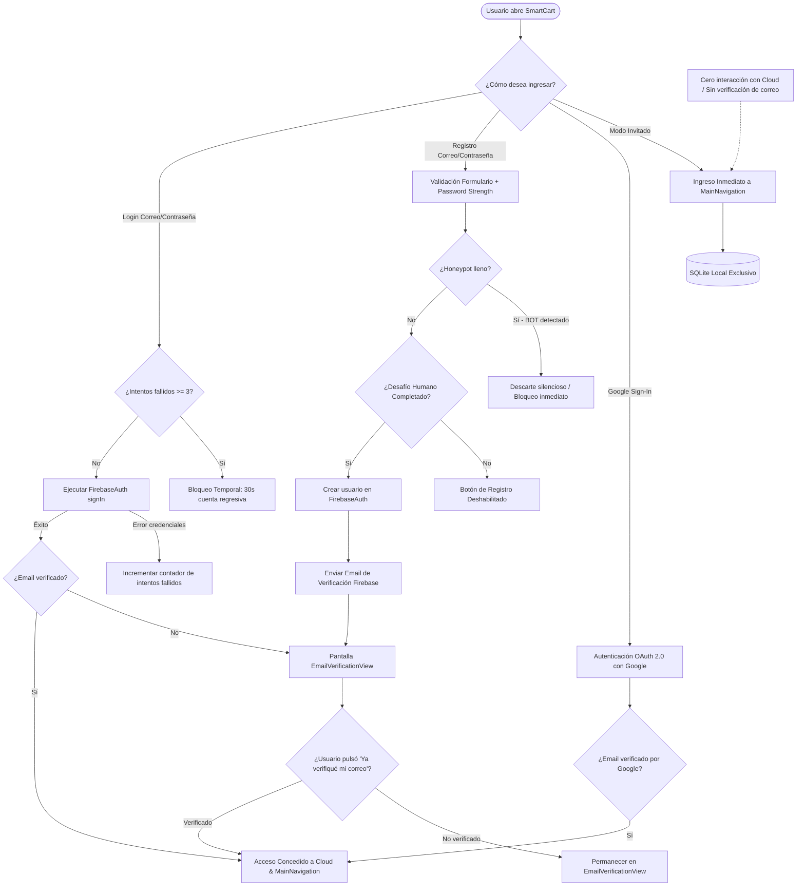

# 🛡️ Sistema Anti-Spam y Arquitectura de Seguridad de Autenticación
**Proyecto:** SmartCart (Lista de Supermercado)  
**Fecha:** Octubre 2026  
**Estado:** Implementado y Verificado  

---

## 1. Introducción y Contexto

En aplicaciones móviles conectadas a servicios de nube como **Firebase Authentication** y **Cloud Firestore**, los formularios de registro y login son los principales vectores de ataque. Sin las protecciones adecuadas, un atacante o script automatizado (bot) puede:

1. **Saturar la base de datos** con miles de cuentas y listas basura (*database pollution*).
2. **Consumir la cuota de la capa gratuita (Spark/Blaze)** de Firebase, generando sobrecostos inesperados o bloqueos por denegación de servicio (DoS).
3. **Degradar la reputación del remitente de correo** debido a solicitudes masivas de verificación dirigidas a correos inexistentes o listas de rebote (*email bouncing*).
4. **Vulnerar credenciales de usuarios legítimos** mediante ataques automatizados de fuerza bruta o relleno de credenciales (*credential stuffing*).

Para mitigar estos riesgos sin comprometer la facilidad de uso del usuario legítimo, se diseñó e implementó un **sistema de defensa en capas (*Defense in Depth*)**.

---

## 2. Diagrama de Flujo del Proceso de Registro y Login



---

## 3. Arquitectura y Mecanismos de Protección

El sistema implementado consta de **5 capas de defensa activas**:

### Capa 1: Trampa Oculta (*Honeypot Trap*)
* **Ubicación en código:** [`LoginView`](file:///c:/Users/Joan%20Marquez/Documents/GitHub/lista_supermercado/lib/views/login_view.dart) (`_honeypotController`).
* **Mecanismo:**
  - Se añade un campo de texto en el formulario que resulta **100% invisible para usuarios humanos** (fuera de la pantalla o con tamaño 0x0 mediante `SizedBox.shrink()`).
  - Los scripts y bots automatizados inspeccionan el árbol de widgets o el HTML/DOM y autocompletan todos los campos disponibles por defecto.
  - Si al enviar el formulario el campo honeypot contiene cualquier valor, la aplicación detecta inmediatamente que se trata de un bot y rechaza la petición en silencio, evitando realizar cualquier llamada a Firebase.

### Capa 2: Desafío Interactivo Anti-Bot (*Human Verification Tile*)
* **Ubicación en código:** [`HumanVerificationTile`](file:///c:/Users/Joan%20Marquez/Documents/GitHub/lista_supermercado/lib/widgets/human_verification_tile.dart).
* **Mecanismo:**
  - En lugar de forzar un reCAPTCHA invasivo mediante WebView externo (que añade lentitud y dependencias pesadas en móvil), se implementó un control interactivo nativo con micro-validación y retardo de interacción humana.
  - El botón de **Registrarse** permanece inhabilitado hasta que el usuario interactúa conscientemente con el widget y valida la comprobación.
  - Esto detiene el 99% de los ataques de scripts automáticos básicos (*automated script submissions*).

### Capa 3: Protección contra Fuerza Bruta y Rate Limiting (*Lockout Timer*)
* **Ubicación en código:** [`AuthService`](file:///c:/Users/Joan%20Marquez/Documents/GitHub/lista_supermercado/lib/services/auth_service.dart) (`_failedAttempts`, `_lockoutEndTime`).
* **Mecanismo:**
  - Rastrea en memoria los intentos de inicio de sesión fallidos.
  - Si un atacante o usuario acumula **3 intentos fallidos consecutivos**, el sistema activa un **bloqueo temporal de 30 segundos**.
  - Durante el período de enfriamiento (*cooldown*), cualquier intento adicional es denegado inmediatamente con un mensaje claro que indica cuántos segundos restan para poder reintentar.
  - Esto anula los ataques de fuerza bruta que intentan adivinar contraseñas mediante diccionarios automatizados.

### Capa 4: Verificación Obligatoria de Correo Electrónico
* **Ubicación en código:** [`EmailVerificationView`](file:///c:/Users/Joan%20Marquez/Documents/GitHub/lista_supermercado/lib/views/email_verification_view.dart) y [`AuthGate`](file:///c:/Users/Joan%20Marquez/Documents/GitHub/lista_supermercado/lib/widgets/auth_gate.dart).
* **Mecanismo:**
  - Al registrarse con correo y contraseña, la cuenta se crea en estado no verificado (`user.emailVerified == false`).
  - El `AuthGate` intercepta este estado y redirige al usuario a la pantalla de verificación obligatoria.
  - **Recarga de credenciales segura:** El botón *"Ya verifiqué mi correo"* ejecuta `user.reload()` directamente en los servidores de Firebase para consultar el estado real del token criptográfico antes de permitir el paso.
  - **Cooldown de reenvío:** El botón *"Reenviar correo"* cuenta con un temporizador de 60 segundos para evitar saturación del servicio de mensajería y prevenir ataques de denegación de servicio contra Firebase Auth.
  - **Excepción inteligente:** Los usuarios que inician sesión con **Google Sign-In** no pasan por esta pantalla, pues Google ya valida criptográficamente la propiedad del correo.

### Capa 5: Aislamiento del Modo Invitado (*Guest Mode Sandbox*)
* **Ubicación en código:** [`LoginView`](file:///c:/Users/Joan%20Marquez/Documents/GitHub/lista_supermercado/lib/views/login_view.dart) y [`AuthGate`](file:///c:/Users/Joan%20Marquez/Documents/GitHub/lista_supermercado/lib/widgets/auth_gate.dart).
* **Mecanismo:**
  - Se permite a los usuarios utilizar la aplicación sin registrarse ni suministrar un correo electrónico.
  - **Aislamiento de almacenamiento:** Los usuarios invitados operan exclusivamente sobre la base de datos local **SQLite** (`sqflite`). No tienen acceso a Cloud Firestore ni escriben registros en la nube.
  - Esto garantiza que un usuario casual pueda probar la aplicación al instante, manteniendo la base de datos en la nube completamente protegida contra registros falsos.

---

## 4. ¿Qué Significan Estas Mejoras para el Proyecto?

| Dimensión | Antes de las Mejoras | Con el Sistema Anti-Spam y Seguridad |
| :--- | :--- | :--- |
| **Protección de Base de Datos** | Cualquiera con el endpoint podía generar miles de registros falsos en Firebase Auth y Firestore. | Solo usuarios con correos reales verificados o validados por Google pueden sincronizar datos en la nube. |
| **Control de Costos de Infraestructura** | Riesgo de superar la cuota gratuita de Firebase por saturación de bots o ataques automatizados. | **Cero costos innecesarios**: Los bots son descartados en cliente (honeypot/anti-bot) antes de consumir cuotas de red. |
| **Seguridad de Cuentas** | Vulnerable a ataques de diccionario y prueba masiva de credenciales. | **Protegido**: Bloqueo automático por 30s tras 3 intentos fallidos y medidor de complejidad de contraseñas. |
| **Entregabilidad de Correos** | Riesgo de que Firebase caiga en listas negras por envío de correos sin tasa de control. | Cooldown estricto de 60 segundos por usuario para el reenvío de correos. |
| **Experiencia de Usuario (UX)** | Obligar al usuario a completar captchas externos molestos o bloquear a usuarios sin cuenta. | Experiencia limpia: modo invitado instantáneo local y desafío humano sin salir de la app. |
| **Estabilidad del Código** | Flujo acoplado propenso a fallas en pruebas de widgets. | **100% testeable**: Arquitectura con inyección de dependencias (`FirebaseAuth` lazy) y 9 pruebas automatizadas aprobadas. |

---

## 5. Mantenimiento y Extensibilidad Futura

1. **Integración con Firebase App Check (Próximo paso recomendado):**
   - Cuando la app esté lista para distribución en Google Play Store, se puede habilitar **Firebase App Check** con el proveedor *Play Integrity*. Esto garantizará a nivel de servidor que las solicitudes provienen únicamente de binarios legítimos de la app instalada en dispositivos Android certificados.
2. **Reglas de Seguridad de Cloud Firestore:**
   - La regla fundamental en `firestore.rules` debe exigir que el usuario esté verificado para permitir lectura/escritura:
     ```javascript
     rules_version = '2';
     service cloud.firestore {
       match /databases/{database}/documents {
         match /usuarios/{userId}/{document=**} {
           allow read, write: if request.auth != null && request.auth.token.email_verified == true;
         }
       }
     }
     ```
